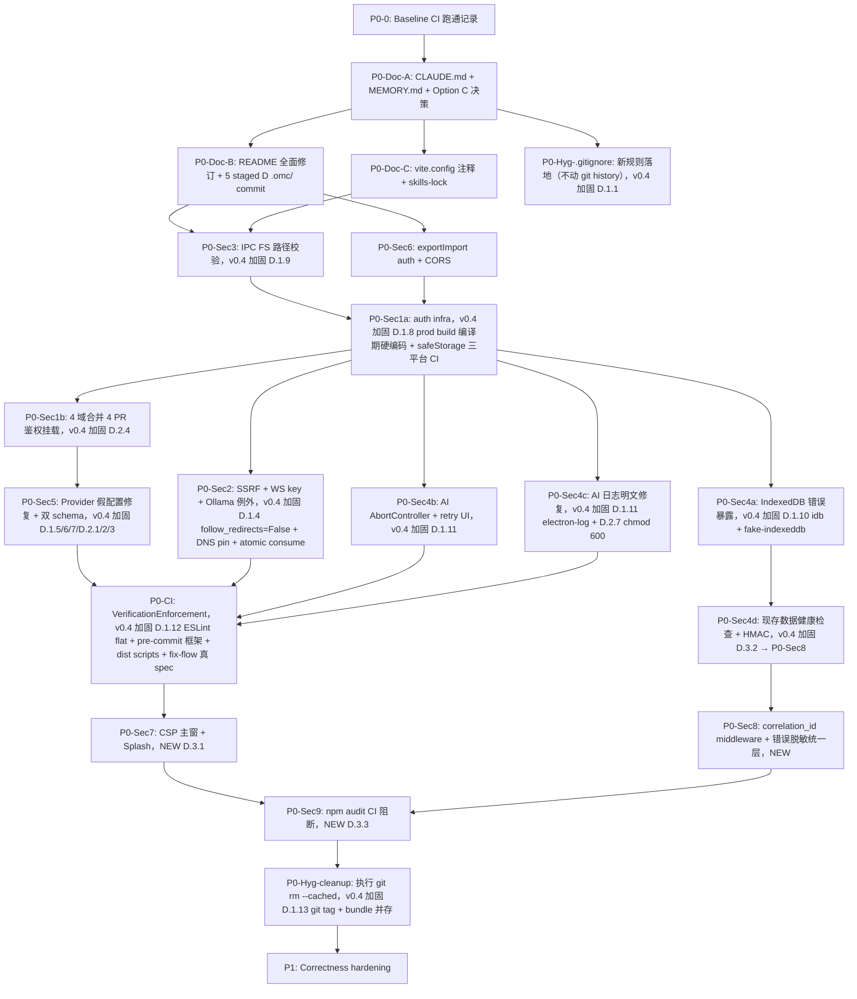

# writer 项目全面审计与长期路线图（v0.4 patch）

> **本 spec 不进入实施。** 范围限定为：盘点家底 + 给出可验收的长期路线图，等待用户批准后再进入 Planner→Architect→Critic 闭环后的具体实施计划。
> 触发场景：用户作为接手人，需要从 0 了解项目状态并决定先做什么。
> **v0.4 patch 来源**：在 v0.3.1（897 行）+ v2 addendum（1773 行）+ 8 条用户决策基础上合并而成，是进入实施阶段前的最终候选 spec。

---

## 0. Executive Summary（一句话）

**项目是一个有较强纪律但安全与文档两面同时存在"红线级谎言"的桌面写作软件**：前端 Zustand 切片和 Vite 分包质量良好、提交 tier-prefix 与单测纪律都在，但 **`src/backend/` 实际是 LIVE 系统却被 CLAUDE.md/MEMORY 标记为 dead code（高风险误删）**、**后端 18 个路由 + WebSocket 全程零鉴权 + 凭据用 XOR 加密 + WS 把 key 放 query string**、**IPC `read-file`/`write-file` 无路径校验**、**IndexedDB 错误吞掉导致用户章节内容可能静默丢失**、**220 个 `.omc/` 文件泄漏 + 22 个 build artifact 被跟踪 + 4 个 CI 脚本引用不存在/平台硬编码**，导致**任何第一次 PR 都会撞墙、任何按 CLAUDE.md 的 cleanup 都会删错**。

接手第一步不是写代码——是**修正文档 + 锁住安全红线**（P0 优先级），然后再做架构重构与功能补齐。

### 0.1 执行假设（Execution Assumptions）

- **实施主体**：单人接手者（owner = sakura）+ 必要时按 PR 粒度外包/合作；**没有常驻 review 团队**，每 PR 自我 review
- **时间盒**：总计 18-30 个月（**P0 7.5-9.5 周** + P1 6-10 周 + P2 3-6 个月 + P3 6-12 个月；v0.4 较 v0.3.1 +1.5 周因 P0-Sec7/8/9 新增）
- **交付节奏**：P0 内部拆为 P0a-QuickWins（1 周，每周可见 commit）/ P0b-BigRocks（5-7 周，每月可见阶段交付）/ P0-CI-VerificationEnforcement（1 周，CI 与 doc-drift 强制落地）/ P0-Hyg-cleanup（1 天，最后执行 git rm）；避免单人接手因 7 周无 PR 而失去 momentum
- **Product signal**：P0/P1 期间允许穿插少量高 ROI 用户可见改进（dark mode / 导出 Markdown / 错误提示优化等 ≤ 2 人天任务），保证 12 个月内不出现"app 停更感"
- **回滚判据**：每项 P0 任务必须可独立 revert，且 revert ≤ 1 天
- **新 critical finding 处理**：7.5-9.5 周 P0 内若发现新 critical finding，**24h 内评估并允许插入 P0 末尾补做**，不必强制走完整 P0→P1 流程
- **BYPASS_AUTH 默认开截止日**：P0-Sec1b 完成日 = 截止日；截止日之前 `BYPASS_AUTH=true` 仅在本地 dev 模式允许，prod build 编译期硬编码 `false`（v0.4 加固：D.1.8）；过期未达成的 commit 触发 reviewer 自动 warning。这条把 §8 风险表的"BYPASS_AUTH 持久 bypass 表面"约束为硬截止日而非软缓解

### 0.2 v0.4 patch 关键变化（与 v0.3.1 对比）

| 维度 | v0.3.1 | v0.4 patch | 触发源 |
|------|--------|------------|--------|
| 路径 | `.omc/plans/...` | `docs/plans/...` | Q1 决策（已执行）|
| 硬阻塞数 | 0（spec 内无 D.1.x）| 11（D.1.1-D.1.13，D.1.4/D.1.10/D.1.11 等含子项）| v2 addendum §D.1 |
| 建议改数 | 0 | 9（D.2.1-D.2.13 子集）| v2 addendum §D.2 |
| 新增 P0 | 0 | 3（P0-Sec7/8/9）| v2 addendum §D.3 |
| P0-Sec1b 实施粒度 | 14 router × 1 PR = 14 PR | 4 域合并 × 1 PR = 4 PR | Q8 决策 + C.2 pushback |
| P0-Sec5 schema | 单 schema `Optional` | 双 schema（masked + 单独端点）| Q3 决策 + D.2.1 |
| safeStorage 实测 | 仅 Windows 风险提示 | Linux/macOS/Windows 三平台 CI matrix | Q4 决策 + D.1.8 |
| pre-commit hook | 强制本地 | CI-only 阻断 + 本地可选 | Q5 决策 + D.2.11 |
| Ollama 例外 | 未提及 | `127.0.0.1:11434` 例外白名单 | Q6 决策 + D.2.12 |
| P0 总工作量 | 6-8 周 | **7.5-9.5 周**（+1.5 周）| Q7 决策（接受延期）|
| Provider keychain | P0-Sec5 等 P0-Sec1a | 独立 secret 文件 + TODO（P0-Sec1a 完成后迁移）| Q2 决策 + D.2.3 |

### 0.3 v0.4 净 lib 引入 / 拒绝（C.3 决策）

| 方向 | 库 | 触发源 |
|------|-----|--------|
| 引入 | `idb` (ISC, ^8.0.0) | D.1.10 / C.3 — IndexedDB Promise wrapper |
| 引入 | `fake-indexeddb` (Apache-2.0, ^6.0.0) | D.1.10 / C.3 — Vitest 自动化 + quota 模拟 |
| 引入 | `electron-log` (MIT, ^5.0.0) | D.1.11 / C.3 — Electron 主进程 logger + rotate + redact |
| 引入 | `lint-staged` (MIT, ^15.0.0) | D.1.12 / C.3 — pre-commit 框架配套 |
| 引入 | `pre-commit` (MIT, ^1.2.2) | D.2.11 / C.3 — pre-commit 框架（CI 阻断 + 本地可选，Q5 决策）|
| 引入 | `eslint` (MIT, ^9.0.0) | D.1.12 / C.3 — ESLint flat config（2026 唯一推荐）|
| 拒绝 | `fastapi-users` | C.3 — overkill for single-user local app |
| 拒绝 | `LiteLLM` | C.3 — +20MB dep，spec 只调 5 个 provider |
| 拒绝 | `safehttpx` | C.3 — kobotoolbox 内部工具，2 年无 release |
| 拒绝 | `semgrep` | C.3 + C.2 — grep 足够，单人学习曲线不值 |
| 拒绝 | `python-jose` | C.3 — 2022-08 后无 release，PyJWT 替代 |
| 拒绝 | `authlib` | C.3 — 杀鸡用牛刀（writer 不是 OAuth2 server）|

**净增 6 库 / 净拒绝 6 库**。

---

## 1. 审计方法学（Audit Methodology）

### 1.1 范围
- **代码层**：`src/frontend/`（前端）、`electron/`（壳层）、`src/backend/`（被错误标记 dead 的 LIVE 后端）
- **配置层**：`package.json` × 3、`tsconfig.json` × 2、`vite.config.ts`、`playwright.config.ts`、`.github/workflows/*.yml`
- **卫生层**：`.gitignore`、`README.md`、`src/frontend/src/styles/design-tokens.css`、`.claude/CLAUDE.md`、`MEMORY.md`
- **测试层**：`src/frontend/src/test/` + `src/frontend/src/__tests__/` + `src/frontend/e2e/journeys/*` + `src/backend/tests/`

### 1.2 工具
- 4 个并行 `code-reviewer` (opus) agent，按子系统分域审计
- 1 个并行 `ai-security-audit` peer agent，专攻安全纵深（独立 worktree 运行，不影响主 checkout）
- **v2 addendum 新增**：7 个外部研究 peer（peer_inputs_received 7/7）+ 3 个对抗审查（C.1 attacker / C.2 engineer / C.3 libs），总计 10/10 peer 已整合
- 静态文本扫描 + AST 节点匹配（npm audit、git check-ignore、git ls-files、find）
- 提交历史取证（`git log --oneline -20` + 关键 commit hash 反查）

### 1.3 评级
- 5 级：**CRITICAL / HIGH / MEDIUM / LOW / info**
- 维度：**stack_health**（green / yellow / red）按子系统独立评级
- 跨子系统去重：相同根因的不同表现合并为 1 条主题 + N 条 finding

### 1.4 已知覆盖 gap
- AI 集成审计（任务队列 / 流式 / 上下文组装 / 6 操作 UI）因 token 上限中途停止；安全关键面已被 peer 覆盖（ai/generate 旁路、provider key、WS 凭据、错误脱敏、auth bootstrap 半成品），**功能性细节（具体 UI 行为、token 计量、IndexedDB schema 演进）建议在执行阶段单独发一次小范围补审**。

---

## 2. 发现清单（按子系统 + 严重度）

> 完整 finding 列表（含 file:line 证据）见附录 A。本节是**经去重**的精简版。

### 2.1 前端（stack_health: yellow，22 findings）

| ID | 严重度 | 主题 | 修复方向 |
|----|--------|------|----------|
| FE-001 | high | `writingStore` 用 `useContentStore.setState()` 直接 mutate 兄弟切片（8 处） | 改走 public actions 或中间件 |
| FE-002 | medium | `aiStore.processNextJob` 用 `await import('./writingStore')` 掩盖循环依赖 | 抽取共享字段或改 caller 传入 |
| FE-003 | high | `store/index.ts` barrel 漏 `useAiProviderStore`/`useTemplateStore`/`editorRegistry`/多个 selector | 统一 barrel 规则 |
| FE-005 | medium | `App.tsx` lazy 加载用 `ComponentType<any>` 绕过类型检查 | 替换为具体 props 类型 |
| FE-007 | medium | `shared/` 下 12 个 Loading/Overlay 文件职责重叠 | 收敛到 3 层（PageLoader/SectionLoader/InlineSpinner）|
| FE-008 | medium | MaterialCard/GlassCard/SpotlightCard 与 shadcn `card.tsx` 边界模糊 | 文档化分层规则 |
| FE-011 | medium | `aiStore.cancelJob` 用 `job.error='取消中...'` 字符串做取消标记 | 改 `AbortController` |
| FE-013 | medium | AI `MAX_RETRIES` 失败后无 UI 重试入口 | 抽屉里暴露 `retryJob` |
| FE-015 | low | 14+ `cleanupXxxStore` 函数无人调用 | 接入路由离开 effect 或删除 |
| FE-017 | low | `settingsDataSlice.ts` 1333 行 | 抽 `createEntityHandlers<T>` 工厂 |
| FE-018 | low | `api/.omc/` 等子目录内 `.omc/` 泄漏 | 由 gitignore 通用化解决（见 §3.4）|
| FE-019 | medium | `useAiProviderStore`/`useTemplateStore` 不在 barrel | 决策保留并加入 barrel 或删除 |
| FE-022 | low | `useShallow` 仅 4 处使用，多组件订阅全字段导致重渲 | 审计 Top-N 组件并应用 |

### 2.2 Electron + IPC + 持久化（stack_health: yellow，18 findings）

| ID | 严重度 | 主题 |
|----|--------|------|
| **F-E-01** | **HIGH** | IPC `read-file`/`write-file` **无路径校验**——渲染端 XSS = 用户全盘 FS 读写 |
| **F-E-02** | **HIGH** | `indexedDBStorage.setItem` 吞掉所有错误（quota exceeded、私密模式、corruption 全部 no-op）|
| **F-E-03** | **HIGH** | `createHybridStorage` 跨阈值收缩时 IndexedDB 留孤儿（quota 累积）|
| **F-E-04** | **HIGH** | `indexedDBStorage.getItem` 读错误返 null → Zustand persist 视为"首次运行"→ 全部状态清空 |
| F-E-05 | MEDIUM | 主窗 + Splash 都无 CSP（v0.4 提升到 P0-Sec7）|
| F-E-06 | MEDIUM | `open-external` 接受任意 URL scheme |
| F-E-07 | MEDIUM | 窗口可见性检查只校验中心 50% 重叠 |
| F-E-08 | MEDIUM | 后端 max-restart 弹错误框但不 `app.quit` |
| F-E-09 | MEDIUM | 健康检查 socket 在 flaky 网络下泄漏 |
| F-E-10 | MEDIUM | electron `tsconfig.json` 比前端宽松（缺 `noUnusedLocals`/`noUnusedParameters`）|
| **F-E-11** | **MEDIUM（信任度 HIGH）** | **CLAUDE.md/MEMORY 撒谎说后端是 dead code**，实际是 LIVE 系统（40+ 文件 import `@/api/*`，CI 工作流引用，`electron_launcher.py` 由 main.ts 拉起 + alembic 跑迁移）|
| F-E-12 | MEDIUM | AI 日志明文 JSONL 落盘（含 prompt/response）|
| F-E-13 | MEDIUM | `cachedApiKey` 仅内存，重启丢失（与 peer batch 4 重复）|
| F-E-14 | LOW | electron-builder ffmpeg.dll 路径 Windows 硬编码 |
| F-E-15 | LOW | `execSync('where python')` 阻塞主进程 |
| F-E-16 | LOW | maximize/fullscreen 事件未 debounce 写窗口状态 |
| F-E-17 | LOW | `appendAILog: (payload: object)` 类型过松 |
| F-E-18 | LOW | `findPython` 未优先 `WRITER_PYTHON` 环境变量 |

### 2.3 工具链 / 卫生 / 测试（stack_health: **red**，25 findings）

| ID | 严重度 | 主题 |
|----|--------|------|
| **F-01** | **CRITICAL** | **220 个 `.omc/` 文件在 8 个非根目录泄漏**（`git ls-files` 实证）；现有 gitignore 只锚根目录 |
| **F-02** | **CRITICAL** | 22 个 build artifact 被跟踪（`electron/dist-electron/` 4 文件、`electron/frontend-build/` 18 文件）|
| **F-03** | **CRITICAL** | CI 引用 `dist:linux`/`dist:mac`，但 `electron/package.json` 只有 `dist:win` |
| **F-04** | **CRITICAL** | `npm run e2e:fix-flow` 脚本存在但 `e2e/journeys/fix-flow/` 目录不存在 |
| F-05 | HIGH | `playwright.config.ts:75` Windows 硬编码 `D:/writer/electron/node_modules/electron/dist/electron.exe` |
| F-06 | HIGH | `npm run lint` 跑 `eslint .`，但 `.eslintrc*` 缺失 + `node_modules/.bin/eslint` 缺失 |
| F-07 | HIGH | README 硬编码 9 个十六进制色值（违反自身 SSOT）|
| F-08 | HIGH | README 写 `cd electron && npm run dev`，**实际脚本名是 `electron:dev`** |
| F-09 | HIGH | CI 后端 pytest 条件判断无 else 分支，配置缺失时**静默跳过** |
| F-10 | HIGH | `vite.config.ts:16-22` proxy 注释自相矛盾 + 描述与代码不一致 |
| F-11 | HIGH | `.claude/worktrees/` 未跟踪但**未 gitignore 保护** |
| F-12 | MEDIUM | git status 显示 5 个 `D .omc/...` 暂存删除 |
| F-13 | MEDIUM | `electron/release/` 含 180MB Windows installer 在工作树 |
| F-14 | MEDIUM | **10 个 store 无单测**：`analyticsStore`, `editorRegistry`, `linkageStore`, `settingsUISlice`, `settingsValidationSlice`, `systemStore`, `templateStore`, `uiStore`, `aiProviderStore`, `utils/crossStoreSync` |
| F-15 | MEDIUM | `vite.config.{js,d.ts}` 与 `vite.config.ts` 并存 |
| F-16 | MEDIUM | 危险 caret 范围：`@types/node: ^25.6.0`、`vitest: ^4.1.6`、`playwright: ^1.61.1` |
| F-17 | MEDIUM | electron tsconfig 比前端宽松（与 F-E-10 重复，合并）|
| F-18 | MEDIUM | Vite `manualChunks` 规则脆弱（字符串包含判断）|
| F-19 | MEDIUM | CI `build-docker` + `generate-installers` + `summary` 与桌面交付模型脱节 |
| F-20 | MEDIUM | 两个测试目录并存（`src/test/` + `src/__tests__/`）无文档分工 |
| F-21 | MEDIUM | `skills-lock.json` 列 13 个 skill，`.claude/skills/` 12 个目录 |
| F-22 | LOW | README 项目树显示错误的 `electron/main/` 子目录 |
| F-23 | LOW | README 安装步骤漏 `electron/` 的 `npm install` |
| F-24 | LOW | `.gitignore:108` 冗余单文件规则 |
| F-25 | LOW | `ux-benchmark.test.ts:6` 注释说覆盖 criteria 1-4,7-8 但 5/6 无 `.todo` 占位 |

### 2.4 安全（peer `ai-security-audit`，12+ findings，跨前/后/壳）

| ID | 严重度 | 主题 |
|----|--------|------|
| **P-A01** | **HIGH** | **后端认证完全旁路**：`security.py:15-23` 的 `verify_api_key` 定义后**从未被任何 router 引用**；18 个 CRUD/AI 路由 + chat WebSocket 全部裸挂载；`config.py:42-43` 硬编码 `writer-local-key-change-me` 默认 key |
| **P-A10** | **HIGH** | **SSRF + 凭据转发**：前端接受任意 provider URL（`AIProviderPanel.tsx:175-181`），后端 `ai_provider.py:42-53` 无 HTTPS/host/内网 IP 白名单 |
| **P-A02a** | **HIGH** | **XOR 加密 provider key**：`security.py:26-42` 用硬编码 `b'writer'*8` 做 pad，DB 一旦泄露即明文 |
| **P-A02b** | **HIGH** | **WebSocket 把 API key 放 query string**：`websocket.ts:251-257` → 落到 access log / 代理 / devtools |
| P-A06 | MEDIUM | 5 个 npm 漏洞（axios 1.0-1.17 / form-data ≤4.0.5 / linkify-it ≤5.0.0 / markdown-it ≤14.1.1 / postcss <8.5.10）|
| P-A09 | MEDIUM | 后端 `str(exc)` → 前端 `error_detail` + 流式 `Error` 含整段响应体 |
| **peer-A-fix** | **HIGH** | **provider 配置写不进去也读不出来**：`routers/ai_provider.py` 缺 update/delete/activate；`ai_generate.py` 永远用全局 env key（**`decrypt_api_key` 零调用者**）；`AIProviderOut` 故意省略 `api_key` 导致编辑表单拿到 undefined |
| **peer-B** | **HIGH** | **`exportImport.ts:69-105` 无 auth + base URL 未解析** |
| peer-C | MEDIUM | CORS 允许所有 localhost 端口 + credentials + 全 methods/headers |
| **peer-D** | **HIGH** | `/ai/generate` 任意 prompt + 任意调用方 + 无输入大小/速率限制 + 错误回 raw exception |
| **peer-E** | **HIGH** | **auth bootstrap 半成品**：前端 `api/auth.ts:22-69` 假设 `/auth/key`、`/auth/key/refresh`、`/auth/status`，**后端完全没有对应路由**；`initAuth` 无人调用；Electron `cachedApiKey` 仅内存 |
| peer-正面 | ✅ | electron `npm audit --omit=dev --audit-level=high` 干净；前端无硬编码 key；git 历史无泄露凭据；AST-grep 不可用但文本扫描覆盖完整 |

---

## 3. 跨切面主题（Cross-Cutting Themes）

> 经过去重后的根因汇总。每条主题可能对应多个 finding。

### 3.1 文档红线级谎言（Documentation lies）
**根因**：CLAUDE.md 与 MEMORY.md 声明后端是 dead code、README 错误脚本名、vite 注释自相矛盾、skills-lock 漂移。任何按文档的 cleanup 都会**删错活系统**或**跑错脚本**。

**对应 findings**：F-E-11、F-07、F-08、F-10、F-21、F-22、F-23、F-12（staged deletes）

**v0.4 新增**：路径已迁出 `.omc/` 到 `docs/plans/`（Q1 已执行），更新所有交叉引用。

### 3.2 安全基础设施完全缺失（Security infra absent）
**根因**：auth 设计 → 实现 → 验证三段都断（设计是有的，代码半截，且 P-A01 让"看起来工作"），key 存储用玩具级 XOR，WS 把 key 放 URL，IPC FS 无路径校验，AI 错误回原文。

**对应 findings**：P-A01、P-A10、P-A02a/b、F-E-01、F-E-05、F-E-06、F-E-12、peer-C、peer-D、peer-E

**v0.4 新增**：F-E-05 (无 CSP) 已升级为 P0-Sec7；error propagation (peer-D/P-A09) 升级为 P0-Sec8。

### 3.3 数据丢失路径已打开（Data loss paths open）
**根因**：IndexedDB 错误吞掉 + 跨阈值留孤儿 + 读错误返 null → 用户章节内容可能静默丢失；AI 取消用字符串 hack 实际上不能停流；AI 失败无 UI 重试。

**对应 findings**：F-E-02/03/04、FE-011、FE-013

**v0.4 新增**：D.3.2 P0-Sec8 (IDB HMAC integrity) 检测 XSS 篡改；D.1.10 跨阈值原子清理引入 `idb` 库；D.1.11 AbortController 真实中断引入 `electron-log`。

### 3.4 仓库卫生债（Repo hygiene debt）
**根因**：`.omc/` 规则只锚根目录 → 220 个文件泄漏；`.gitignore` 写了 build artifact 但未执行 `git rm --cached`；CI 脚本与 package.json 不同步；worktree 未保护。

**对应 findings**：F-01、F-02、F-03、F-04、F-11、F-13、F-15、F-19、F-24

**v0.4 新增（D.1.1 + D.1.2 + D.1.3 + D.1.13）**：brace 语法修正为 5 行独立 `**/.omc/{state,...}/` + 改为 committe `.gitignore`（不依赖 `.git/info/exclude`）+ 删 filter-repo 误引 + 加 git tag 逐文件回滚 + path 迁出 `.omc/` 到 `docs/`（Q1 已执行）。

### 3.5 测试覆盖严重不对称（Test coverage asymmetric）
**根因**：16 个 store/slice 中只 6 个有单测；11 个 writing 子模块中 dashboard/snapshots/corkboard 无 e2e；fix-flow journey 缺失；UX benchmark 4 个 criteria 静默未覆盖。

**对应 findings**：F-14、F-04、F-20、F-25

### 3.6 架构边界债务（Architecture boundary debt）
**根因**：writingStore → contentStore 直接 setState 破坏 slice 隔离；store barrel 不全；aiStore 循环依赖用动态 import；14+ cleanup 函数无人调用；settingsDataSlice 1333 行。

**对应 findings**：FE-001、FE-002、FE-003、FE-015、FE-017、FE-019、FE-007、FE-008

### 3.7 错误传递与可观测性不足（Error propagation & observability）
**根因**：后端 raw exception 直接到 UI；IndexedDB/crossStoreSync 错误吞掉；appendAILog 类型过松；window state 写文件未批处理。

**对应 findings**：P-A09、F-E-02/04、FE-014、F-E-16、F-E-17

**v0.4 新增（D.3.2 P0-Sec8）**：统一错误脱敏层从 P1 提升到 P0；引入 `correlation_id` middleware；前端 ErrorBoundary + AI 抽屉统一消费。

---

## 4. RALPLAN-DR Deliberate 章节

### 4.1 Principles（3-5 条不可妥协的原则）

1. **P-DOC-FIRST**：在删除任何代码或修改任何 CLAUDE.md 之前，**必须**先验证 CLAUDE.md/MEMORY.md 的当前声明与代码状态一致。如果不一致，**先修文档**，再做任何 cleanup。本项目已经因为文档与代码不一致导致至少一次"误删后端"的潜在风险（F-E-11）。
2. **P-SEC-BEFORE-FEAT**：任何功能新增、性能优化、UI 改进前，**必须**先完成 P0-Sec 全部 9 项（v0.4 含 P0-Sec1a/1b/2/3/4a/4b/4c/4d/5/6/7/8/9 中除 P0-Sec6 已就位外全 P0-Sec）。违反此原则等于在沙地上盖楼。
3. **P-FAIL-LOUD**：禁止 `catch { /* swallow */ }`、禁止错误吞掉、禁止 silent fall-through。所有错误要么上抛到 UI、要么记录到带 correlation_id 的日志、要么触发已定义的重试/降级路径。
4. **P-LIVING-DOC**：CLAUDE.md / README / 设计 tokens / 文档必须与代码状态一致；引入 CI 检查（grep / lint）防止再次漂移。
5. **P-MINIMAL-SECRET**：API key / token / 用户隐私字段**任何时刻**都不允许出现在 URL、access log、git history、纯文本日志、AI 日志明文。**v0.4 加固（D.2.1）**：provider 列表响应永远不返完整 key，必须走单独 `/providers/{id}/key` 端点。

### 4.1.1 原则冲突解决规则（v0.4 加固）

当两条原则冲突时，按以下优先级解决：

```
P-DOC-FIRST > P-SEC-BEFORE-FEAT > P-FAIL-LOUD > P-MINIMAL-SECRET > P-LIVING-DOC
```

**典型冲突场景与解决**：
- **P-FAIL-LOUD vs P-MINIMAL-SECRET**：要求记录错误 vs 禁止 log 敏感字段
  - **解决**：**redact-then-log**（先脱敏再记录）— redact 失败必须 fail-loud 报警（meta-log 不被 redact）
- **P-MINIMAL-SECRET vs P-LIVING-DOC**：日志脱敏 vs 文档反映真实状态
  - **解决**：**example-based docs**（文档示例用 `sk-***` 占位符而非真实 key 格式）
- **P-SEC-BEFORE-FEAT vs P-DOC-FIRST**：安全先行 vs 文档先行
  - **解决**：**P-DOC-FIRST 优先**——文档撒谎会让后续 P-Sec 修复走偏方向（v0.4 §5.1 P0-Doc-A 必须先于 P0-Sec1a/2/5/6 启动）

### 4.2 Decision Drivers（top 3，决定路线图顺序的驱动力）

1. **数据安全 > 用户体验**：用户的小说章节、AI 日志、provider key 是不可恢复资产。任何修复都按"先堵漏、再优化"排序。
2. **正确性 > 完整性**：P0 必须 100% 完成才能进入 P1；P1 必须 100% 完成才能进入 P2；不允许跳过 P0 直接做架构重构（"先重构再修 bug"是常见反模式）。
3. **可验证 > 可写**：每条 P0 都有可执行的测试或 grep 断言作为完成判据。没有断言 = 没完成。

### 4.3 Viable Options（≥2，每条有 pros/cons）

#### Option A：按本 spec 的 P0a→P0b→P0-CI→P0-Hyg-cleanup→P1→P2→P3 顺序执行（P0 内部细分层）（**推荐**）
- **Pros**：先堵漏后优化，风险可控；每阶段可发布；文档先修正避免误删；P0 内部分层后单人接手者每周可见 commit 信号，避免失去 momentum。
- **Cons**：P0 总体工作量大（v0.4 共 13 项 P0 主题，安全/文档/卫生/数据恢复/新增 CSP/HMAC/npm-audit），拆为 P0a+P0b 后每周都有 1-2 个 PR 落地。
- **何时选**：任何对生产数据敏感、对外部用户负责的接手方式（默认推荐）。

#### Option B：先做架构重构（写作域 slice 拆分、loading 组件收敛、store barrel 统一）再修安全
- **Pros**：接手者能更快理解代码、做改动更顺。
- **Cons**：**P-A01 全程未鉴权**意味着重构期间任何 XSS/依赖漏洞都会变成数据外泄；P-A10 让任何重构都可能被 SSRF 利用；F-E-02/03/04 让用户章节内容可能在重构期间静默丢失。**强烈不推荐**。
- **何时选**：仅在本地玩具 / 无外部用户 / 数据可重生的场景。

#### Option C：把"删除 `src/backend/`"作为第一目标，把 AI 全部迁到纯前端调用
- **Pros**：彻底消除后端失守风险；架构更简单；单一仓库。
- **Cons**：等价于重写整个 AI 流水线（18 个 FastAPI 路由 → 前端 services + 直接调用 provider API + token 计量 + 流式 + IndexedDB 替代 SQLAlchemy + alembic 替代 schema 迁移 + WebSocket 改 SSE 或 polling）。**工作量预估 6-12 个月**。P0 安全问题仍然要先修。
- **何时选**：用户明确表态"我希望最终没有 Python 后端"，且接受此时间投入。**v0.4 状态**：原 §9.2 Q1 在 P0-Doc-A 内必须做出决策（**目前未决**）。

#### Option D：跳过 P0 直接进 P2（用户自承风险）（**显式拒绝**）
- **Pros**：节省 7.5-9.5 周时间；用户接受安全风险；可立刻开始架构改进。
- **Cons**：违反 §4.2 driver #1（数据安全 > 用户体验）、driver #2（正确性 > 完整性）、§4.1 P-SEC-BEFORE-FEAT 与 P-FAIL-LOUD。接手者跳过 P0 等于在沙地上盖楼。
- **何时选**：仅在纯个人 toy 项目、无任何外部用户、数据可重生的场景。当前 writer 不符合。

#### Option E：保留 src/backend/ 但最小化（仅留 AI 流式 + auth，CRUD/章节存储迁前端）（**显式拒绝**，但作为终态愿景值得记录）
- **Pros**：保留 auth 边界 + 流式基础设施（避免 Option C 的 6-12 个月完整重写）；CRUD/章节存储用 IndexedDB/本地 SQLite；P0 安全问题仍然修。**比 Option C 更务实**。
- **Cons**：等价于中等规模重写（~3-6 个月）；P0/P1 部分工作（Sec5 provider 修复）作废；需评估前端 IndexedDB 是否能承担章节内容存储的写入放大。
- **何时选**：用户明确表态希望"减少后端暴露面但不彻底删除"，且接受 3-6 个月中等重写。

#### Recommendation：Option A
- Option B 把风险窗口延长到"重构做完之前"全部开放，违反 P-SEC-BEFORE-FEAT 与 P-DOC-FIRST。
- Option C 是终态愿景，但应该作为路线图的**末段里程碑（P3）**，不是 P0 替代方案。
- Option D 显式拒绝——违反 driver #1/#2 与两条原则。
- Option E 作为"如果用户对 Option C 犹豫时的折衷选项"记录到 P3-Removal 的子选项；不在 P0/P1 实施期间启动。
- **P0 必须先完成 Option A 的全部 P0a/P0b/P0-CI/P0-Hyg-cleanup/P0-Sec7/P0-Sec8/P0-Sec9 项，才能讨论 Option C 或 Option E**。

### 4.4 Pre-mortem（8 个失败场景，deliberate 模式必须）

**场景 1：6 个月后用户写完 10 万字，但保存的章节在重启后全部丢失。**
- 触发条件：F-E-02/03/04 修复未做；FE-011 AbortController 改造引入新写入路径但未覆盖 IndexedDB；FE-013 重试 UI 接入了但底层 store 仍按字符串比较取消标记。
- 早期信号：QA 报告 `e2e/cold-start` 通过但 `e2e/regression/phase-7-quota` 失败；用户报告"刚才还在的内容不见了"。
- 预防措施：P0-Data 完成后必须新增 Playwright spec 模拟 quota-exceeded / private-mode / corruption 三种场景；IndexedDB 单元测试覆盖降级路径。**v0.4 加固**：D.3.2 P0-Sec8 加 HMAC 完整性校验，检测 XSS 篡改。

**场景 2：接手者按 CLAUDE.md 的指引删除了 `src/backend/`，整个应用 30 秒后崩溃。**
- 触发条件：F-E-11 未修；新成员 onboarding 时读到"src/backend/ 是历史遗留，按 dead code 处理"；执行清理。
- 早期信号：CLAUDE.md 还有 `D .omc/specs/2026-07-11-cleanup-*.md` 这类删除暂存 → 给人"以前确实删过"的暗示。
- 预防措施：P0-Doc 必须先完成；CI 加 `grep -r "src/backend/ 是历史遗留" .claude/ MEMORY.md` 失败即阻断合并；CLAUDE.md 显式标注 backend 是 LIVE。**v0.4 加固**：路径已迁出 `.omc/` 到 `docs/plans/`（Q1 已执行），新协作成员不会因 `.omc/` 命名惯性误读为 OMC runtime。

**场景 3：AI provider key 在用户电脑被某个流氓 npm 包读取并外发。**
- 触发条件：P-A02a XOR 加密未替换；P-A10 SSRF 未加白名单；AIProviderPanel 让用户填任意 provider URL；前端依赖注入 XSS。
- 早期信号：网络安全日志显示从用户 IP 向非常规 host 的 HTTPS POST；用户账单异常。
- 预防措施：P0-Sec 全部 9 项必须完成；外加 npm audit 强制（CI fail-on-high，P0-Sec9 落实）；CSP 锁住 script-src（P0-Sec7 落实）；provider URL 强校验为 https + 已知 host 白名单。**v0.4 加固**：P0-Sec2 加 `follow_redirects=False` + DNS rebinding pin + WS Origin allowlist + ticket atomic consume。

**场景 4：P0-Sec1 retrofit 中某 router 鉴权改造与流式响应交互不当，用户看到一半被截断的 AI 输出（半鉴权态不变量破坏）。**
- 触发条件：P0-Sec1 在 4 个合并 PR 上挂载 `Depends(verify_api_key)`，但 `/ai/generate` / `/ai/review` / `/chat/ws` 的流式/SSE 响应上下文里 `verify_api_key` 失败会让已经发出去半条消息丢失；spec 当前未规定"已开始无法撤回"的流式响应如何处理。
- 早期信号：本地测试看到 `/ai/generate` 返回 401 但前端 console 出现半条 SSE 消息；reviewer 反馈 streaming endpoint 的 auth error 应该延迟到首条 chunk 之后再判断，或提前 buffer 完整 response。
- 预防措施：P0-Sec1a 阶段明确 streaming endpoint 的 auth 策略（建议：依赖 caller-side abort signal + 鉴权失败时尝试 abort 而非 raise）；每个 streaming router 的 Playwright auth-baseline spec 单独跑覆盖"鉴权失败发生在 chunk 1 之前 vs 之后"两种时序。**v0.4 适应**：PR 粒度从 14 PR 改为 4 PR（D.2.4 / Q8）后，每个 PR 覆盖的 router 数更多，**此场景的 early-signal 在 PR review 时更容易被单一 reviewer 漏掉**——需在 PR description 显式标注 streaming router 的时序覆盖要求。

**场景 5：P0 期间发现新 critical finding（如 0day 漏洞 / 仓库私钥泄露），但因无 hotfix 通道被压到 P1 队列。**
- 触发条件：spec 当前未规定 P0 期间的新 critical finding 处理通道；7.5-9.5 周 P0 内发现新 finding 时，executor 可能选择"按顺序等 P0 完成后再处理"，期间暴露窗口达数周。
- 早期信号：依赖漏洞扫描（npm audit Snyk）出现 critical；安全公告（GitHub Security Advisories）命中。
- 预防措施：建立"hotfix lane"——24h 内评估新 critical finding 是否需要插队 P0 末尾补做；非 critical 新 finding 进入 P1 队列按正常顺序处理；hotfix lane 不破坏 P0 整体节奏。**v0.4 加固**：P0-Sec9 (npm audit CI 阻断) 上线后，npm critical CVE 自动暴露，hotfix lane 触发频率上升。

**场景 6：P0-Sec7 CSP 上线后第三方依赖（react-force-graph / Tiptap / Framer Motion）被 block，前端渲染断裂。**
- 触发条件：`script-src 'self'` + `connect-src` 白名单 + `frame-src 'none'` 启用后，react-force-graph 的 Web Worker 加载、Tiptap 的内联 SVG schema 注入、Framer Motion 的 blob: URL 动画被 CSP 阻断；本地开发模式可绕过，prod build 全部白屏。
- 早期信号：P0-Sec7 上线后 Playwright e2e:cold-start 通过但实际 UI 渲染空白；用户反馈"打开应用只有背景看不到界面"。
- 预防措施：P0-Sec7 实施前先 audit `npm run build` 产物中的内联 SVG / blob: URL / Web Worker 使用；对必须允许的 source 加 nonce 或 hash（v0.4 已在 D.3.1 模板中给 `'unsafe-inline'` 作为 Tiptap + Framer Motion 的临时过渡）；P0-Sec7 上线后必须 24h 监控 + 即时回滚开关。

**场景 7：P0-Doc-A 决策 Option C "走"，导致 P0-Sec1a/1b/2/5/6 全部作废需重做。**
- 触发条件：用户在 P0-Doc-A 阶段决定 Option C（删除 src/backend/），但 spec 当前 P0 主题（P0-Sec1~6）全部假设 backend LIVE。决策与已写好的 P0 主题冲突，需立即重排 P0 顺序。
- 早期信号：P0-Doc-A PR 评论里出现"选 C 的话整个 P0-Sec1 都不能做了"；架构师介入要求重排。
- 预防措施：Option C 决策必须在 P0-Doc-A 内连同"如果选 C，P0 后续步骤如何重排"的子决策一起做出；P0-Doc-A PR description 必须包含决策树（决策 A → 走原 P0 顺序；决策 C → 走精简版 P0 仅前端安全）；P0-Doc-A 的回滚成本估算 ≤ 2h（仅文档修改）。**v0.4 状态**：决策未做，待 P0-Doc-A 同 PR 内裁决。

**场景 8：P0-Sec5 Provider schema 变更（双 schema）导致旧用户已存的 provider 配置反序列化失败。**
- 触发条件：旧用户的 provider row 在 SQLite 中以"无 api_key 字段"序列化；新双 schema（`AIProviderOut.masked_key` + `ProviderKeyOut.api_key`）强制要求新字段，pydantic v2 strict mode 触发 ValidationError；启动时 settings 加载失败。
- 早期信号：应用启动后 settings 页面打开报 500；pytest 的 backward-compat test 失败；用户报告"应用突然读不到我之前的 provider 配置"。
- 预防措施：v0.4 落地 alembic `batch_alter_table` migration（D.1.5）+ pydantic `Optional[str] = None` + 旧 row 反向兼容测试（D.1.7 含 4 个 200 断言）；P0-Sec5 完成判据增加"旧 provider row 反向兼容测试"（pytest 用 fixture 注入旧格式行，验证仍能 list + activate，但 update 时强制重写 api_key）。

### 4.5 Expanded Test Plan（unit / integration / e2e / observability）

> 每条 P0 都对应一组测试。spec 进入实施阶段后此表会被 Planner→Architect→Critic 进一步细化。
> **本表覆盖全部 13 项 P0 子主题**（v0.4 扩字段后，含 P0-Sec7/8/9 三个新增项）。

| 阶段 | 测试类型 | 范围 | 工具 |
|------|----------|------|------|
| P0-0 baseline | observability | `npm run lint && npm test && npm run e2e:cold-start` 全跑并写入 `.omc/baselines/2026-07-21/baseline-report.md`；CI grep baseline report 存在 | shell script + CI |
| P0-Doc-A | unit + observability | `grep -r "src/backend/ 是历史遗留" .claude/ README.md` 退出码 1；`git log --all -p -S 'writer-local-key-change-me' -- src/ | wc -l == 0`；`git log --all -p | grep -E 'sk-[a-zA-Z0-9]{20,}' | wc -l == 0`（P-MINIMAL-SECRET 强制）；**v0.4 新增**：`ls .omc/plans/ 2>/dev/null` 不存在（路径已迁出）| shell + git |
| P0-Doc-B | observability | `grep -rE "#[0-9a-fA-F]{6}" README.md` 仅在 token 引用注释匹配；`cd electron && npm run electron:dev --dry-run` 退出码 0；5 个 staged `D .omc/...` 已 commit | shell + git |
| P0-Doc-C | observability | `vite.config.ts` proxy 注释与代码一致；`skills-lock.json` 与 `.claude/skills/` 目录数一致 | diff |
| P0-Hyg-.gitignore | observability | `git check-ignore` 对 `src/frontend/src/.omc/state/`、`electron/.omc/state/`、`.claude/worktrees/` 都返回 0；`!.omc/skills/**` 例外存在；**v0.4 加固（D.1.1）**：`**/.omc/{state,sessions,phases,artifacts,handoffs,notepad.md,project-memory.json,research,bundles,logs,ultragoal}/` 每行独立（非 brace 展开）；冗余规则已删 | shell |
| P0-Sec1a (auth infra) | unit + integration | `verify_api_key` 单元；`/auth/key`、`/auth/key/refresh`、`/auth/status` 路由契约（**v0.4 强制同 PR 落地：D.1.8**）；safeStorage 加密往返；frontend `initAuth` 流程；双标志位 (`AUTH_STRICT_MODE` / `BYPASS_AUTH`) 默认值与切换；**v0.4 新增（D.1.8）**：prod build 编译期硬编码 `BYPASS_AUTH=false` + runtime env 被忽略；safeStorage Linux fallback（scrypt + machine-id）三平台实测 | Vitest + pytest + GitHub Actions matrix |
| P0-Sec1b (4 域合并) | unit + e2e | 4 域 router（CRUD 8 个 / 实体 2 个 / AI 6 个 / Chat WS 1 个）逐域 Playwright `auth-baseline.spec.ts`（每域 1 PR，共 4 PR）；streaming endpoint 覆盖"鉴权失败发生在 chunk 1 之前 vs 之后"两种时序；每 router 独立 happy path 200/401/403；**v0.4 加固（Q8 / D.2.4）**：4 PR 而非 14 PR | Playwright |
| P0-Sec2 (SSRF + WS) | unit + e2e | **v0.4 加固（D.1.4）**：URL 解析器拒绝 13 类输入（9 类 + `169.254.169.254` / IPv6 ::1 / IPv4-mapped ::ffff:10.0.0.1 / NAT64 64:ff9b::/96）；`follow_redirects=False`；DNS resolve 后每条 A/AAAA 都校验 is_global + IPv4-mapped unwrap；WS 升级请求 query string 不含 api_key（仅 ticket）；**v0.4 新增（Q6 / D.2.12）**：`127.0.0.1:11434` Ollama 例外白名单；ticket atomic consume (SQLite `INSERT OR IGNORE` + `DELETE RETURNING`)；Origin allowlist `http://localhost:5173` / `app://writer`；**v0.4 加固（白名单外 https host 测试）**：尝试 provider URL = `https://attacker-proxy.com/v1/` 被拒（不在 4 个公开 host 白名单 `api.openai.com` / `api.anthropic.com` / `api.mistral.ai` / `generativelanguage.googleapis.com` 内）| pytest + Playwright |
| P0-Sec3 (IPC FS) | unit + e2e | Electron Playwright：尝试 `window.electronAPI.readFile('C:/Users/.../.ssh/id_rsa')` 失败；尝试 `/` 路径失败；**v0.4 加固（D.1.9）**：渲染端只能传 dialog-returned 256-bit token（`secrets.token_urlsafe(32)`）；主进程 `Map<token, {path, expiresAt, perm}>` LRU 60s 过期；token 单次有效（`file:read` 一次后 delete）；`openExternal` 黑名单 `file://` `javascript:` `data:` `vbscript:`；用户取消 dialog → 静默返 null | Playwright electron |
| P0-Sec4a (IndexedDB) | unit + e2e | **v0.4 加固（D.1.10）**：引入 `idb` 库 + `fake-indexeddb` 自动化；5 种失败场景（quota exceeded → throw / private-mode → throw / corruption → throw / not-found → null / aborted transaction → retry）；payload 跨阈值收缩时旧 IDB entry 原子清除（`batch_alter_table` 模式，删最旧 25%）；`IndexedDBStorageError` 分类 enum | Vitest + fake-indexeddb |
| P0-Sec4b (AI cancel + retry) | unit + e2e | `cancelJob` 真实中断 fetch 流（reader.releaseLock() 显式 cleanup）；MAX_RETRIES 失败的 job 在 drawer 显示 retry 按钮；点击 retry 后 `processNextJob` 重新消费；流式响应在 cancel 时立即停止 chunk 接收 | Vitest + Playwright |
| P0-Sec4c (AI log 明文) | unit + e2e | **v0.4 加固（D.1.11）**：引入 `electron-log` 库；redact 函数单元测试覆盖 prompt/response/api_key/url_token/session_id/password/secret/authorization 字段；默认状态 userData 无 ai-log.jsonl；opt-in 开启时 redact 必须生效；**v0.4 新增（D.2.7 / D.2.9）**：日志文件 `chmod 0o600` owner-only；AI log 不落 query string（`api_key=` / `token=` 不出现在 log 行）| Vitest + Playwright |
| P0-Sec4d (现存数据健康检查) | unit + e2e + manual | 启动时 IndexedDB 健康扫描逻辑单测；Playwright 模拟 `indexedDB.open` 失败 → banner 显示；**手动测试**：本地制造 quota exceeded 场景后启动应用 → banner 显示 + 备份入口可用；**v0.4 加固（D.3.2 → P0-Sec8）**：HMAC-SHA256 完整性校验（master key 来自 OS keychain）+ corrupt 备份到 `userData/.corrupt/` + banner 一键删除可疑 entry | Vitest + Playwright + manual |
| P0-Sec5 (Provider) | unit + e2e | **v0.4 加固（D.1.5 / D.1.6 / D.1.7 / D.2.1 / D.2.2 / D.2.3 / D.2.5 / D.2.13）**：alembic `batch_alter_table` migration（4 列：base_url / model / is_active / use_env）；partial unique index `providers_single_active WHERE is_active=1`；原子切换 `UPDATE...SET 0 + UPDATE...SET 1` 同事务；pydantic v2 `Optional[str] = None` + `ConfigDict(extra='forbid')`；**双 schema**：`AIProviderOut.masked_key` 列表 + `GET /providers/{id}/key` 返 `ProviderKeyOut.api_key` 完整 key；`use_env` 显式 fallback；`decrypt_api_key` 共享 P0-Sec1a keychain master key（**P0-Sec1a 完成前暂用独立 secret 文件 + TODO** Q2 决策）；`decrypt_api_key` 零调用者修复（peer-A-fix）；**旧格式 provider row 反向兼容测试**（fixture 注入旧格式行 → 仍可 list + activate，update 时强制重写 api_key）；SDK 边界防御职责 docstring | pytest + Playwright |
| P0-Sec6 (exportImport + CORS) | unit + e2e | Playwright：导出操作带 Authorization header；未带时 401；pytest：CORS preflight 仅对允许 origin 返回 header | pytest + Playwright |
| **P0-Sec7（CSP，NEW）** | unit + e2e | **v0.4 新增（D.3.1）**：Electron 主窗 + Splash 配 CSP header（`default-src 'self'` + `script-src 'self' 'unsafe-inline'` 临时过渡 + `style-src 'self' 'unsafe-inline'` + `img-src 'self' data: blob:` + `connect-src 'self' ws://127.0.0.1:8000 + 已知 provider hosts` + `object-src 'none'` + `base-uri 'none'` + `frame-ancestors 'none'`）；Playwright e2e:cold-start 通过 + DevTools 检查无 inline script 阻塞；Tiptap / Framer Motion 兼容性测试 | Playwright + DevTools 手动 |
| **P0-Sec8（correlation_id + 错误脱敏，NEW）** | unit + e2e | **v0.4 新增（D.3.2）**：后端 `correlation_id` middleware（`X-Request-ID` header + response 回传 + log 关联）；统一错误脱敏层（raw exception → `{code, message, correlation_id}` 结构化响应）；前端 ErrorBoundary + AI 抽屉统一消费 correlation_id 显示给用户；HMAC IDB integrity 校验（master key 来自 OS keychain 共享 P0-Sec1a）| Vitest + pytest + Playwright |
| **P0-Sec9（npm audit CI 阻断，NEW）** | CI | **v0.4 新增（D.3.3）**：`.github/workflows/lint.yml` 加 `npm audit --omit=dev --audit-level=high`；CVE critical/high 阻断 PR merge；axios 1.18+ / form-data 4.0.6+ / linkify-it 5.0.1+ / markdown-it 14.2+ / postcss 8.5.10+ 升级路径在 P1-CI2 | GitHub Actions + npm audit |
| P0-CI VerificationEnforcement | unit + CI | `npm run lint` 跑通；**v0.4 加固（D.1.12）**：ESLint v9 flat config (`eslint.config.js`) + 必要 devDependencies + 三平台 CI matrix（ubuntu/macos/windows）；`electron/package.json`：补 `dist:linux`/`dist:mac` 脚本（`--linux AppImage deb` / `--mac dmg`）；**v0.4 加固（D.1.12）**：`e2e:fix-flow` 必须有真 spec（`expect(page).toHaveTitle(/writer/i)`）而非空 stub；`playwright.config.ts` 用 `String(require('electron'))` 无硬编码 Windows 路径；`check:hygiene` 脚本在 CI 命中违规文件；`check:docs` 脚本检测 CLAUDE.md/MEMORY/README 漂移；**v0.4 新增（Q5 / D.2.11）**：pre-commit hook **CI-only 阻断**，本地 README 文档化可选安装；**v0.4 加固（D.1.12）**：`.pre-commit-config.yaml` hooks 路径在 `~/.cache/pre-commit/`，不在 repo 内（避免 hook 钓鱼）；`lint-staged` 配合 pre-commit 框架 | shell + npm + Vitest (hook script) + GitHub Actions |
| P0-Hyg-cleanup | CI + 手动恢复测试 | `git ls-files | grep '\.omc/' | grep -vE '(^|/)\.omc/(plans|specs|research)/'` 为空（**v0.4 加固 D.1.2**：`plans/specs/research` 已迁 `docs/`，该 grep 改为 `git ls-files | grep '\.omc/'` 必须为空）；`git ls-files | grep -E '(frontend-build|dist-electron|release/)'` 为空；`git tag backup-pre-hygiene-2026-07-21` 存在；**v0.4 加固（D.1.13）**：`git bundle verify .omc/bundles/pre-hygiene-2026-07-21.bundle` 通过 + per-file selective restore 流程文档化（`git checkout backup-pre-hygiene-2026-07-21 -- <path>`）| shell + git + git bundle |
| P0-Hotfix Lane | process | 新 critical finding 24h 内评估记录（文档即可）；hotfix 单项工作量 ≤ 1 周；hotfix 不破坏 P0 整体节奏 | manual review |
| P0-Doc (汇总) | observability | CI：`grep -r "src/backend/ 是历史遗留" .claude/ README.md && exit 1`；CI：`grep -rE "writer-local-key-change-me" src/ && exit 1`；CI：`git log --all -p -S 'writer-local-key-change-me' -- src/ | wc -l == 0`；**v0.4 新增**：CI：`ls .omc/plans/ 2>/dev/null` 退出码 1（路径已迁）| CI grep + git |
| P0-Hyg (汇总) | CI | 新增 `npm run check:hygiene` 脚本：`git ls-files | grep '\.omc/'` 必须为空；`git ls-files | grep 'frontend-build'` 必须为空 | shell script |

### 4.6 ADR（Architecture Decision Record）

#### Decision
**P0 必须按 §5.1 顺序完成 13 项（v0.4 较 v0.3.1 +3 项新增 P0-Sec7/8/9），才能进入 P1。** 不允许跳过 P0。P1 必须 100% 完成才能进入 P2。

#### Drivers
- §4.2 列出的 3 个驱动力 + §4.1 的 5 条原则 + 安全审计的"红色区域必须先消除"
- v0.4 额外：v2 addendum §D.1 11 硬阻塞 + §D.3 3 新增 P0（用户 Q7 全部接受进 P0）

#### Alternatives considered
- 见 §4.3 三条 Option（已否决 B 与 C）
- v0.4 推翻原 spec P0-Sec1b "14 PR" 方案（Q8 / D.2.4）→ 改为 4 PR 合并
- v0.4 推翻原 spec P0-Sec5 "AIProviderOut 不省略 api_key" 方案（D.2.1）→ 改为双 schema

#### Why chosen
- P0 是"stop the bleeding"，不做任何功能前必须完成
- P1 是"correctness hardening"，在 P0 之上建立可信的 CI 与 e2e 基线
- P2 是"code quality"，到这一层才允许大动作架构重构
- v0.4 新增的 3 项 P0（Sec7/8/9）虽然让 P0 总时长 +1.5 周，但每项都对应已被 v2 peer 验证的真实风险窗口（C.1 attacker 验证 CSP 24h 内可触发；npm critical CVE 自动暴露需 hotfix lane 通道）

#### Consequences
- **正面**：接手者按 spec 推进时，每个阶段都有可验证的产物；安全风险随 P0 完成显著下降；CI 从"4 个脚本直接挂"变为可用；provider key 永远不返完整 key 给 list 端（贴 P-MINIMAL-SECRET）
- **负面**：P0 工作量大（约 7.5-9.5 周全职工作量，比 v0.3.1 多 1.5 周）；P1 与 P2 可能拉长到 12-18 个月
- **机会成本**：如果用户希望快速出 release，P0 是绕不过的代价

#### Follow-ups
- 每完成一个 P0/P1 主题，必须更新 CLAUDE.md 中相关声明
- 每完成一个 P1 测试主题，必须把对应的 spec 加到 `e2e/regression/phase-N/`
- P2 重构（settingsDataSlice 工厂、loading 收敛、card 分层）应该在 P1 完成后单独发 spec

---

## 5. 阶段路线图（Phased Roadmap）

> 每条都有**验收判据**与**完成判据**。完成判据 = 测试/grep 断言 + reviewer pass。
> **v0.4 patch**：P0 主题由 12 项增至 13 项（P0-Sec7/8/9 新增），总工作量 6-8 周 → 7.5-9.5 周。

### 5.1 P0 — Stop the bleeding（**建议 7.5-9.5 周全职**，所有项必须完成才能进入 P1）

> **P0 内部分层（按 Architect synthesis path）**：P0-0 baseline → P0a QuickWins（1 周，每周 1-2 PR）→ P0b BigRocks（5-7 周）→ P0-CI VerificationEnforcement（1 周）→ P0-Hyg-cleanup（1 天，最后执行）。P0 整体仍必须 100% 完成才能进入 P1。
> **v0.4 调整**：P0b 由 4-6 周延至 5-7 周（因 P0-Sec7/8/9 新增 + P0-Sec1b 合并 4 PR + P0-Sec4d 加 HMAC）。

#### P0-依赖图（v0.4 更新版）



#### Phase 0.0 — Baseline（**1 天，先做**）
- **目的**：记录 P0 启动前的 CI/e2e/单测基线，作为后续 P0 完成的对照基础
- **动作**：
  - 跑一次完整：`npm run lint`、`npm test`、`npm run e2e:cold-start`（如可用）
  - 把所有已知 failure 整理为 `baseline-report.md`（含 pass/fail 计数、关键错误信息）
  - 在 `.omc/baselines/2026-07-21/` 提交 baseline 报告（**注意**：v0.4 后路径可能迁出 `.omc/`；实际位置由 P0-Hyg-cleanup 决定）
- **完成判据**：baseline 报告存在；后续 P0 每完成一项可对照 baseline 报告计算 improvement

---

#### P0a — QuickWins（**~1 周**，可独立发布 5-7 个 PR；先并行起步，串行收尾）

##### P0-Doc-A：CLAUDE.md / MEMORY.md backend 段修正（**~4 小时，第一 PR**）
- F-E-11、memory 历史归档
- **动作**：
  - CLAUDE.md 把"src/backend/ 是历史遗留，按 dead code 处理"改为"`src/backend/` 是 LIVE 系统，18 个 FastAPI 路由由 `electron/main.ts:201-301` 拉起"；列出 backend 真实状态（FastAPI 路由清单、alembic 迁移、e2e 启动依赖）
  - MEMORY.md 删除/标记过期的 `project_backend_pivot_20260709.md` 与 `project_backend_rebuild_plan.md`；保留 `project_cleanup_20260711.md` 但加注脚"本次 cleanup 仅删除了运维期文档，未触及 src/backend/"
  - **Open Question #1（Option C 走/不走）的决策必须在此 PR 内做出**：决策记录到 MEMORY.md 顶部；走 Option C 则本 spec 路由需重排（见 §9.2）
  - **v0.4 新增（D.1.2 决策后）**：更新所有 `.omc/plans/` → `docs/plans/` 路径引用（Q1 已执行迁移，此处仅是 doc 文本同步）
- **回滚方案**：单 PR revert ≤ 1h
- **完成判据**：
  - `grep -r "src/backend/ 是历史遗留" .claude/ README.md` 退出码 1
  - `grep -r "按 dead code 处理" .claude/CLAUDE.md` 退出码 1
  - Option C 决策已写入 MEMORY
  - **路径迁出 grep 断言**（Q1 / v0.4 加固）：`grep -rE '\.omc/(plans|specs|research)/' .claude/ README.md MEMORY.md src/ docs/ electron/ 2>/dev/null | wc -l` 必须为 0；显式待更新文件清单：(a) `.claude/CLAUDE.md §约束`、(b) `MEMORY.md` 5 条 [历史归档] 引用、(c) `README.md` 项目树与命令、(d) `docs/plans/v2/addendum-2026-07-21.md` 附录 A/B 路径、(e) v0.4 spec 自身内部交叉引用
  - **Git history 扫描**（P-MINIMAL-SECRET 强制）：
    - `git log --all -p -- src/ README.md .claude/ MEMORY.md | grep -E 'sk-[a-zA-Z0-9]{20,}' | wc -l` 必须为 0
    - `git log --all -p -S 'writer-local-key-change-me' -- src/ | wc -l` 必须为 0
    - `git log --all --pretty=format: | grep -E 'sk-ant-[a-zA-Z0-9-]{20,}' | wc -l` 必须为 0
  - **v0.4 新增**：`ls .omc/plans/ 2>/dev/null` 退出码 1（路径已迁出）
  - reviewer pass

##### P0-Doc-B：README 全面修订（**~4 小时**）
- F-07、F-08、F-12、F-22、F-23
- **动作**：
  - README 把 9 个硬编码十六进制色值（F-07）改为"详见 `src/frontend/src/styles/design-tokens.css`"
  - README 修 `cd electron && npm run dev`（F-08）→ `npm run electron:dev`
  - README 修项目树（F-22）（`electron/main.ts`/`electron/preload.ts` 改为扁平文件）
  - README 加 `cd electron && npm install` 步骤（F-23）
  - 提交 5 个 staged `D .omc/...` 删除（F-12）（**与 P0-Doc-A 完成后做，不与 P0-Doc-A 并行**——避免误删 cleanup-design.md 这类决策记录）
- **回滚方案**：单 PR revert ≤ 1h
- **完成判据**：
  - README 中所有 `cd electron && npm run X` 命令实际可执行（dry-run 验证）
  - `grep -rE "#[0-9a-fA-F]{6}" README.md` 仅在引用 token 的注释中匹配
  - 5 个 staged 删除已 commit

##### P0-Doc-C：vite.config 注释 + skills-lock 对齐（**~2 小时**）
- F-10、F-21
- **动作**：
  - `vite.config.ts:16-22` proxy 注释删除或重写为准确描述（backend 是 LIVE，proxy 实际生效）
  - `skills-lock.json` 与 `.claude/skills/` 实际目录对齐
- **回滚方案**：单 PR revert ≤ 30min
- **完成判据**：diff 校验 + reviewer pass

##### P0-Hyg-.gitignore：.gitignore 新规则（**~1 小时**，**串行必须在 P0-Doc-A CLAUDE.md backend 段修正 commit 之后启动**）
- F-01、F-11、F-15、F-24
- **关键约束**：**只新增规则，不执行 `git rm --cached`**（cleanup 推迟到 P0-Hyg-cleanup 末尾）
- **动作（v0.4 加固 D.1.1）**：
  - 展开 brace 语法为独立 5 行（git 不支持 brace 展开）：
    ```gitignore
    **/.omc/state/
    **/.omc/sessions/
    **/.omc/phases/
    **/.omc/artifacts/
    **/.omc/handoffs/
    **/.omc/notepad.md
    **/.omc/project-memory.json
    **/.omc/research/
    **/.omc/bundles/
    **/.omc/logs/
    **/.omc/ultragoal/
    ```
  - 保留唯一 re-include 例外：`!.omc/skills/**`
  - **v0.4 加固（D.1.2）**：删除 `!.omc/plans/` `!.omc/specs/` `!.omc/research/` 例外（已迁 `docs/`，Q1 已执行）
  - 加 `.claude/worktrees/`、`screenshots/`、`vite.config.{js,d.ts}`、`*.tsbuild`
  - 删除冗余 `electron/release/win-unpacked/Writer.exe` 单文件规则（F-24）
- **完成判据**：
  - `git check-ignore /d/writer/src/frontend/src/.omc/state/` 退出码 0
  - `git check-ignore /d/writer/electron/.omc/state/` 退出码 0
  - `git check-ignore /d/writer/.claude/worktrees/` 退出码 0
  - `git check-ignore /d/writer/.omc/skills/foo/bar.md` 退出码 1（re-include 生效）

##### P0-Sec3：IPC FS 路径校验（**~3 天**）
- F-E-01、F-E-06
- **动作（v0.4 加固 D.1.9）**：
  - 重构 IPC `read-file` / `write-file`：渲染端只能传 dialog 返回的 256-bit token（`secrets.token_urlsafe(32)`）；主进程 `Map<token, {path, expiresAt, perm}>` LRU 60s 过期；token 单次有效（`file:read` 一次后 delete）
  - `open-external`：黑名单 `file://` `javascript:` `data:` `vbscript:`，仅允许 `https:` 和 `http:`
  - 用户取消 dialog → 静默返 null（无 toast）
- **回滚方案**：单 PR revert ≤ 2h（主进程逻辑独立）
- **完成判据**：
  - Playwright electron：调用 `window.electronAPI.readFile('C:/Users/.../.ssh/id_rsa')` 失败
  - Playwright：调用 `window.electronAPI.openExternal('file:///C:/...')` 失败（黑名单）
  - Playwright：调用 `window.electronAPI.openExternal('javascript:alert(1)')` 失败
  - Playwright：调用 `window.electronAPI.openExternal('https://example.com')` 通过
  - Playwright：dialog 取消后 renderer 收到 null
  - 单元测试覆盖 dialog token 解析 + 60s 过期 + LRU 清理

##### P0-Sec6：exportImport auth + CORS 收紧（**~3 天**）
- peer-B、peer-C
- **动作**：
  - `api/exportImport.ts`：加 auth header；走 `getBackendUrl()` 解析 base URL
  - 后端 `app/main.py`：CORS 限制为单一来源（`app://` 或具体 origin）
- **回滚方案**：单 PR revert ≤ 1h
- **完成判据**：
  - Playwright：导出操作带 Authorization header；未带时 401
  - pytest：CORS preflight 仅对允许的 origin 返回 `Access-Control-Allow-Origin`

---

#### P0b — BigRocks（**~5-7 周**，每 router/每 PR 单跑；v0.4 较 v0.3.1 延 1-3 周）

##### P0-Sec1a：auth infra 落地（**~1 周**）+ e2e 实施策略（v0.4 加固）
- P-A01、P-A02a、peer-E、F-E-13（前半：基础设施）
- **动作（v0.4 加固 D.1.8）**：
  - 后端：实现 `/auth/key`、`/auth/key/refresh`、`/auth/status` 路由（**v0.4 强制同 PR 落地，禁止 partial impl**）
  - 后端：替换 `config.py:42-43` 默认 key 为"首次启动随机生成 + 写入 OS keychain"；移除硬编码 `writer-local-key-change-me`
  - 后端：替换 XOR 加密为 AES-GCM（`cryptography.hazmat.primitives.ciphers.aead.AESGCM`）；key 在 OS keychain 或独立 secret 文件（`python-keyring` 抽象 backend），DB 只存 ciphertext + 12-byte nonce
  - 后端：实现 `verify_api_key` 依赖；从 OS keychain 读取 secret
  - 后端：**v0.4 加固**：prod build 编译期硬编码 `BYPASS_AUTH=false`，runtime env 被忽略（`os.environ.get("ELECTRON_PRODUCTION_BUILD") == "1"` 时强制 false，否则 `RuntimeError`）
  - Electron：`cachedApiKey` 改为 `safeStorage.encryptString()` + 落盘 userData
  - Electron：**v0.4 加固**：safeStorage Linux fallback（`libsecret-1-dev` + GNOME Keyring / KWallet 不可用时回退 scrypt + machine-id + user-salt）；**v0.4 新增（Q4）**：三平台 CI matrix (ubuntu-latest / macos-latest / windows-latest) 各跑一次 `safeStorage.isEncryptionAvailable()` 检测脚本
  - 前端：补 `initAuth` 接入应用启动
  - 引入双标志位机制：`AUTH_STRICT_MODE`（per-router 标志，默认关）+ `BYPASS_AUTH`（process 标志，默认 false）
- **e2e 实施策略（v0.4 加固，避免 P0-Sec1a + BYPASS_AUTH 编译期硬编码的 CI 死锁）**：
  - **(a)** P0 阶段 CI e2e 跑 **dev build**（electron-builder `--dir` + `NODE_ENV=development` + `ELECTRON_PRODUCTION_BUILD=0`）；BYPASS_AUTH 编译期常量 = `false`，runtime `os.environ.get("ELECTRON_PRODUCTION_BUILD") == "0"` 时允许临时 override 为 `true`
  - **(b)** **prod build e2e**（electron-builder `--win nsis` + `NODE_ENV=production` + `ELECTRON_PRODUCTION_BUILD=1`）**推迟到 P1 阶段**；P0 阶段不测 prod build e2e
  - **(c)** 关键不变式：`ELECTRON_PRODUCTION_BUILD=1` 时 `BYPASS_AUTH=true` env 必须 raise `RuntimeError`（D.1.8 强制）；dev build（`ELECTRON_PRODUCTION_BUILD=0`）允许 env override
  - **(d)** spec 显式标注：CI workflow 在 P0 阶段只跑 dev build e2e；P1-CI 才补 prod build e2e
- **回滚方案**：双标志位都支持，默认状态可回到当前行为
- **完成判据**：
  - 1 个 router 在 strict mode 下真实 401/403 + happy path 200（作为 baseline）
  - Playwright auth-baseline.spec.ts 模板（每 router 1 份）
  - Vitest：`safeStorage` 加密往返一致
  - **v0.4 加固**：GitHub Actions matrix 三个 runner 全部 `safeStorage.isEncryptionAvailable() === true`（Linux basic_text 回退时 fail build）
  - **v0.4 加固**：prod build 时注入 `BYPASS_AUTH=true` env → 检测到 `RuntimeError` 抛错（不静默）

##### P0-Sec1b：4 域合并 4 PR 鉴权挂载（**~1.5 周**，v0.4 从 14 PR 改为 4 PR）
- P-A01 后半
- **动作（v0.4 推翻 14 PR 方案 → 4 域合并 Q8 / D.2.4）**：
  - 4 个 PR（每 PR 含 3-4 router）：
    - PR-1（CRUD 域）：projects / chapters / drafts / outlines / rules / world_settings / factions / locations（8 routers）
    - PR-2（实体域）：characters / items（2 routers）
    - PR-3（AI 域）：ai_provider / ai_generate / ai_review / ai_fill_fields / ai_rewrite_description / ai_generate_entity（6 routers）
    - PR-4（Chat WebSocket）：1 个 chat WS
  - 每个 PR 必须包含独立的 Playwright `auth-baseline.spec.ts`（不依赖其他 PR）
  - 流式 endpoint（`/ai/generate`、`/chat/ws`）单独 spec 覆盖"鉴权失败发生在 chunk 1 之前 vs 之后"两种时序（pre-mortem 场景 4）
  - 任意时刻 `AUTH_STRICT_MODE=false` 可回滚
- **回滚方案**：每域 PR 独立 revert
- **完成判据**：
  - `git grep -nE "verify_api_key" src/backend/app/routers/` 至少有 14 处引用（4 PR 合并后总计）
  - `git grep -nE "(writer|local-key|change-me)" src/backend/app/` 退出码 1
  - 所有 14 router 在 strict mode 下 401/403 + happy path 200
  - **v0.4 适应**：4 PR 各自的 PR description 显式标注 streaming router 的时序覆盖要求（应对 pre-mortem 场景 4）

##### P0-Sec2：SSRF + WS key + Ollama 例外（**~1 周**）
- P-A10、P-A02b
- **动作（v0.4 加固 D.1.4 + Q6 / D.2.12）**：
  - 后端 `services/ssrf_guard.py`（新增）：URL 解析 → 拒绝非 https → 检查 host 白名单（含 `127.0.0.1:11434` Ollama 例外 Q6）→ DNS resolve 后每条 A/AAAA 都校验 is_global + IPv4-mapped unwrap + NAT64 unwrap → pin 首个 IP 重写 URL（保持 Host header 给 SNI）→ `httpx.AsyncClient(follow_redirects=False)`（**D.1.4 强制**）
  - 前端 `websocket.ts`：移除 query string 的 api_key，改用短期 ticket
  - 后端 `services/ws_ticket.py`（新增）：`POST /auth/ws-ticket` 签发 256-bit opaque ticket + 5 分钟过期；`/chat/ws` 升级时 `consume_ticket`（SQLite `INSERT OR IGNORE` + `DELETE RETURNING` 原子消费） + Origin allowlist (`http://localhost:5173` / `app://writer`)
- **回滚方案**：WS ticket 关闭回退到 cookie；URL 白名单改为 allow-all 仅作 dev mode
- **完成判据**：
  - pytest：URL 解析器拒绝 13 类恶意输入（9 类 + `169.254.169.254` / IPv6 ::1 / IPv4-mapped `::ffff:10.0.0.1` / NAT64 `64:ff9b::/96` / redirect chain）
  - Playwright：尝试 `provider URL = http://127.0.0.1:22` 被拒
  - Playwright：尝试 `provider URL = http://169.254.169.254` 被拒
  - Playwright：尝试 `provider URL = https://attacker-proxy.com/v1/` 被拒（白名单外）
  - Playwright：尝试 `provider URL = https://example.com → 302 → http://127.0.0.1` 被拒（redirect closed）
  - Playwright：尝试 `provider URL = http://127.0.0.1:11434/v1` 通过（Ollama 例外 Q6）
  - Playwright：DevTools Network 面板里 WS 升级请求 query string 仅含 ticket，**NO api_key**
  - Playwright：Origin `http://evil.com` 拒绝
  - pytest：同 ticket 第二次 WS 升级 → 拒绝（atomic consume）

##### P0-Sec4a：IndexedDB 错误暴露（**~1 周**）
- F-E-02/03/04、FE-014
- **动作（v0.4 加固 D.1.10）**：
  - 引入 `idb` 库（`^8.0.0`）Promise wrapper
  - `indexedDBStorage.getItem`：区分 not-found（返 null）和 failed（抛错）
  - `indexedDBStorage.setItem`：抛错而非吞掉
  - `createHybridStorage`：payload 跨阈值收缩时清除旧 IDB entry（**v0.4 加固**：HARD 阈值 100MB 触发，最旧 25% 原子删除，引入 `fake-indexeddb` 自动化测试 quota 场景）
  - `crossStoreSync.createCleanupRegistry` 错误：log + 上抛到 toast
  - 引入 devDep `fake-indexeddb` (`^6.0.0`) 用于 Vitest 自动化
- **回滚方案**：error 抛错行为可配置；旧 catch 行为作 fallback
- **完成判据**：
  - Vitest + fake-indexeddb：5 种 IndexedDB 失败场景（quota exceeded / private-mode / corruption / not-found / aborted transaction）全部按预期（3 抛错、1 返 null、1 重试）
  - Playwright：quota exceeded 模拟下章节不消失，UI 显示 inline 错误

##### P0-Sec4b：AI AbortController + retry UI（**~1 周**）
- FE-011、FE-013
- **动作（v0.4 加固 D.1.11）**：
  - `aiStore.cancelJob`：改用 AbortController；job 持 `AbortSignal`；cancel 时 abort；reader.releaseLock() 显式 cleanup
  - `aiStore.processNextJob` MAX_RETRIES 失败：标记 dead-letter；抽屉暴露 `retryJob` 按钮
  - streaming response 的 AbortSignal 与 fetch 的 signal 串联
- **回滚方案**：cancelJob 双实现可切换（AbortController vs 旧字符串 hack）
- **完成判据**：
  - Vitest：`cancelJob` 真实中断 fetch 流（`fetchPromise.rejects.toThrow(/abort/i)`）
  - Playwright：AI 失败后 drawer 出现 retry 按钮，点击可重新入队
  - 流式响应在 cancel 时立即停止接收 chunk

##### P0-Sec4c：AI 日志明文修复（**~3 天**）
- F-E-12（已上盘 6+ 月不能等 P1）
- **关键约束**：**禁止 opt-in 模式**（违反 P-MINIMAL-SECRET）；默认 off；任何开启时 prompt/response 强制 redact secret 字段
- **动作（v0.4 加固 D.1.11 + D.2.7 + D.2.9）**：
  - 引入 `electron-log` 库（`^5.0.0`）作为 Electron 主进程 logger
  - 默认 no-op；开启时强制 redact（`REDACT_PATHS = ['api_key', 'token', '*.apiKey', 'password', 'secret', 'authorization']`）
  - 日志文件路径 `app.getPath('logs')/ai-log.jsonl`，rotate ≤ 10MB
  - **v0.4 加固（D.2.7）**：日志文件 `chmod 0o600` owner-only access
  - **v0.4 加固（D.2.9）**：日志不落 query string（`api_key=` / `token=` 不出现在 log 行）
- **回滚方案**：默认 no-op 即是回滚
- **完成判据**：
  - `grep -nE "prompt.*response" electron/main.ts | grep -v redact` 退出码 1
  - Playwright：默认状态下 userData 无 ai-log.jsonl
  - opt-in 开关记录的内容经过 redact 函数验证
  - **v0.4 加固**：日志文件 `stat.mode & 0o777 === 0o600`
  - **v0.4 加固**：AI log 行不包含 `api_key=` 或 `token=` 字串

##### P0-Sec4d：现存数据健康检查 + HMAC（**~3 天**，v0.4 加固）
- F-E-02/03/04 历史遗留处理 + **D.3.2 P0-Sec8 协同**
- **动作（v0.4 加固 D.3.2 HMAC 同步在 P0-Sec8 实施）**：
  - 应用启动时扫描 IndexedDB 各 store：检查 `getItem` 失败但 key 存在的 store 列表
  - 若发现历史遗失（store 有部分 key 缺失），向用户弹 banner："检测到 N 个 store 存在数据缺失，建议从备份恢复"
  - **v0.4 加固**：每个 IDB entry 写入时附 HMAC-SHA256（master key 来自 OS keychain 共享 P0-Sec1a）；启动时 HMAC mismatch → 标记为可疑 + 备份到 `userData/.corrupt/` + banner 一键删除
  - 备份 API 复用 projectDataStore.triggerBackup
- **回滚方案**：banner 显示逻辑可关闭
- **完成判据**：
  - Playwright：模拟 `indexedDB.open` 失败时 banner 显示
  - 手动测试：本地制造 quota exceeded 场景后启动应用
  - **v0.4 加固**：Vitest 手动篡改 1 个 IDB entry → 启动后 banner 显示 + 一键删除按钮可见

##### P0-Sec5：Provider 假配置修复（**~1 周**）
- peer-A-fix（4 个细分 finding）
- **动作（v0.4 重大加固 D.1.5/6/7 + D.2.1/2/3/5/13）**：
  - **v0.4 加固（D.1.5）**：alembic `batch_alter_table` migration 加 4 列（`base_url` / `model` / `is_active` / `use_env`），data migration 把现有 single row 设为 `is_active=1`，backfill 后改 NOT NULL
  - **v0.4 加固（D.1.5）**：pydantic v2 `ConfigDict(extra='forbid')` + `Optional[str] = None`
  - **v0.4 加固（D.1.6）**：partial unique index `CREATE UNIQUE INDEX providers_single_active ON providers(is_active) WHERE is_active = 1`；原子切换 `UPDATE SET 0 + UPDATE SET 1` 同事务
  - **v0.4 加固（Q3 / D.2.1 双 schema）**：`AIProviderOut`（列表用）只返 `masked_key`（`sk-****...****abcd`）；`ProviderKeyOut`（编辑用）单独端点 `GET /providers/{id}/key` 返 `api_key` 完整 key
  - **v0.4 加固（Q3 / D.2.2）**：DB 加 `use_env: bool` 列 + UI checkbox；env fallback 仅在 `use_env=true` 显式开启时
  - **v0.4 加固（Q2 / D.2.3）**：`decrypt_api_key(ciphertext) -> str` 共享 P0-Sec1a keychain master key；**P0-Sec1a 完成前暂用独立 secret 文件 + 标注 TODO**
  - **v0.4 加固（D.2.5）**：Anthropic SDK / OpenAI SDK 边界防御职责 docstring（`ssrf_guard.py` 是边界，SDK 只做 URL 合并 + HTTP 转发）
  - **v0.4 加固（D.2.13）**：alembic batch 模式 SQLite 大表限制注释（provider 行数 < 100 OK）
  - 后端 `routers/ai_provider.py`：补 update / delete / activate 路由
  - 后端 `services/ai_generate.py`：真正解密并使用存储的 provider 行；env key 仅作 fallback（**peer-A-fix 核心：decrypt_api_key 零调用者修复**）
  - 前端 `AIProviderPanel.tsx`：根据双 schema 调整；保存后回显成功状态；编辑时走 `/providers/{id}/key` 拉完整 key
- **回滚方案**：schema 改回旧版本兼容（双 schema 后向兼容层）
- **完成判据**：
  - pytest：`PUT /providers/{id}` 200，`DELETE /providers/{id}` 204，`POST /providers/{id}/activate` 200（**D.1.6**：两个 active provider 触发 partial unique index 错误）
  - **v0.4 加固（D.1.7）**：旧格式 provider row 反向兼容测试（fixture 注入旧格式行 → `GET /providers` 200 含 masked_key；`POST /providers/99/activate` 200；`PUT /providers/99` 含新 api_key → 200）
  - **v0.4 加固（Q3 / D.2.1）**：`GET /providers` 响应 body 任何路径均无完整 key 字符串（grep 验证）
  - Playwright：UI 保存 provider → 后端实际调用该 provider（mock provider 验证 base_url+api_key 真用，不是 env）
  - Playwright：编辑表单加载时从 `/providers/{id}/key` 拿到正确的 key（不再是 undefined）

##### **P0-Sec7：CSP 主窗 + Splash（**NEW ~3 天**，v0.4 从 P1-Sec7 提升 D.3.1）**
- F-E-05
- **触发**：C.1 attacker 综合判断（"24h 内可触发"）+ §4.4 pre-mortem 场景 6
- **动作**：
  - Electron `session.defaultSession.webRequest.onHeadersReceived` 注入 CSP header：
    ```
    default-src 'self';
    script-src 'self' 'unsafe-inline';
    style-src 'self' 'unsafe-inline';
    img-src 'self' data: blob:;
    connect-src 'self' ws://127.0.0.1:8000
      https://api.openai.com https://api.anthropic.com
      https://api.mistral.ai https://generativelanguage.googleapis.com;
    object-src 'none';
    base-uri 'none';
    frame-ancestors 'none';
    ```
  - 主窗 + Splash 同步应用
  - `'unsafe-inline'` 作为 Tiptap + Framer Motion 临时过渡（未来可改 nonce/hash）
- **回滚方案**：env `WRITER_DISABLE_CSP=1` 紧急回滚开关
- **完成判据**：
  - Playwright e2e:cold-start 通过
  - 手动打开 React DevTools 检查无 inline script 阻塞
  - CSP header 实际出现在响应头（curl 验证）

##### **P0-Sec8：correlation_id + 错误脱敏统一层 + IDB HMAC（**NEW ~2-3 天**，v0.4 D.3.2）**
- P-A09 + D.2.6 + pre-mortem 场景 1
- **动作**：
  - 后端 `correlation_id` middleware：`X-Request-ID` header（生成或透传）+ response 回传 + log 关联
  - 后端统一错误脱敏层：raw exception → `{code, message, correlation_id}` 结构化响应（不再是 `str(exc)` 原文）
  - 前端 `ErrorBoundary` + AI 抽屉统一消费 correlation_id 显示给用户
  - 前端 IDB HMAC-SHA256 完整性校验：master key 来自 OS keychain（与 P0-Sec1a 共享）；每个 IDB entry 写入时附 HMAC；启动时 scan：HMAC mismatch → 标记为可疑 + 备份到 `userData/.corrupt/` + banner 提示用户可一键删除
- **回滚方案**：middleware 可关闭（env `WRITER_DISABLE_CORRELATION_ID=1`）；HMAC banner 可关闭
- **完成判据**：
  - Vitest：X-Request-ID 透传测试；raw exception 不出现在 response body
  - Playwright：错误显示给用户时含 correlation_id
  - **v0.4 加固**：Vitest 手动篡改 1 个 IDB entry → 启动后 banner 显示 + 一键删除按钮可见

##### **P0-Sec9：npm audit CI 阻断（**NEW ~2 天**，v0.4 D.3.3）**
- P-A06（部分）+ 持续漏洞防御
- **动作**：
  - `.github/workflows/lint.yml` 加 `npm audit --omit=dev --audit-level=high`
  - CVE critical/high 阻断 PR merge
  - 5 个已知 CVE 升级路径保留在 P1-CI2（axios / form-data / linkify-it / markdown-it / postcss）
- **回滚方案**：workflow 可单独 disable（不推荐）
- **完成判据（v0.4 修订，消除 self-defeating 完成判据）**：
  - GitHub Actions `npm audit` 步骤存在并运行
  - **二选一显式声明**（实施时由 executor 选定，写入本节完成判据）：
    - **(2a)** workflow 装上后 `main` 分支立即 `fail-on-high` 但 `PR` 分支仅 `warn`——避免与 P1-CI2 修复窗口冲突；P1-CI2 完成后切换为 `(2b)`
    - **(2b)** P0-Sec9 实施前先在独立 PR 升级 5 个 CVE（axios 1.18+ / form-data 4.0.6+ / linkify-it 5.0.1+ / markdown-it 14.2+ / postcss 8.5.10+），P0-Sec9 完成判据含 '升级 PR 合并后 `npm audit --omit=dev --audit-level=high` 0 high'
  - 选定 (2a) 还是 (2b) **必须在 P0-Sec9 启动 PR 的 description 中显式标注**，reviewer pass 验证
  - **回写**：P0-Sec9 实施方案选定后回写 P1-CI2 重新估算（v0.4 §5.2 line 813）

---

#### P0-CI — VerificationEnforcement（**~1 周**，原 P1-CI1 + P1-Doc3 提前到此）
- F-04、F-05、F-06、F-09、全部 doc-drift finding
- **关键约束**：**P0 的可验证性部分依赖此节完成**——必须把 CI 与 doc-drift 强制在 P0 内落地，否则 P0 完成度判据无法被自动化验证
- **动作（v0.4 加固 D.1.12 + Q5 / D.2.11）**：
  - **v0.4 加固**：ESLint v9 flat config（`eslint.config.js`）+ 必要 devDependencies + `npm run lint` 跑通
  - **v0.4 加固**：`electron/package.json` 补 `dist:linux`/`dist:mac` 脚本（`--linux AppImage deb` / `--mac dmg`）
  - **v0.4 加固**：`e2e:fix-flow` 必须有真 spec（`expect(page).toHaveTitle(/writer/i)`）而非空 stub
  - `playwright.config.ts`：用 `String(require('electron'))` 替换硬编码 Windows 路径
  - **v0.4 加固**：`playwright.config.ts` CI script 中所有硬编码 Windows 路径同步替换
  - CI 加 `check:hygiene` 脚本（git ls-files grep 校验 .omc/ leak + build artifact）
  - CI 加 `check:docs` 脚本（CLAUDE.md/MEMORY/README 漂移检测，grep 关键字符串）
  - **v0.4 新增（Q5 / D.2.11）**：pre-commit hook **CI-only 阻断**；本地开发者 README 文档化推荐安装（**不强制**）
  - **v0.4 加固（D.2.8）**：`.pre-commit-config.yaml` hooks 路径在 `~/.cache/pre-commit/`，不在 repo 内（避免 `.git/hooks/` 钓鱼）
  - **v0.4 加固**：`lint-staged` 配合 pre-commit 框架（`src/**/*.{ts,tsx}` → `eslint --fix` + `vitest related --run`；`electron/**/*.ts` → `eslint --fix`）
- **回滚方案**：CI 脚本可单独 skip；pre-commit hook 可配置禁用
- **完成判据**：
  - `npm run lint` 跑通（即使只检查自身文件）
  - `npm run e2e:fix-flow` 不再 ENOENT
  - CI grep check 命中预期的违规文件
  - pre-commit hook 安装并可在本地触发（README 文档化 + `.pre-commit/install.sh` 幂等）
  - **v0.4 加固**：CI 实际阻断 PR（测一个故意有 lint error 的 commit 验证）
  - **v0.4 加固**：`.pre-commit-config.yaml` 存在且 hook 路径在 `~/.cache/pre-commit/`

---

#### P0-Hyg-cleanup：执行 git rm --cached（**~1 天，最后做**）
- F-01 / F-02 / F-11 / F-13 的实际清理动作
- **前置条件**：P0-CI 完成（确保 check:hygiene 已在 CI 兜底）
- **动作（v0.4 加固 D.1.3 + D.1.13）**：
  - **v0.4 加固（D.1.13）**：先 backup 双轨：
    ```bash
    git tag backup-pre-hygiene-2026-07-21 $(git rev-parse HEAD)
    git bundle create .omc/bundles/pre-hygiene-2026-07-21.bundle --all
    ```
  - `git rm -r --cached` 220 个 `.omc/` 路径 + 22 个 build artifact 路径
  - 5 个 staged `D .omc/...` 删除 commit 已在 P0-Doc-B 完成，无需重复
  - `rm -rf electron/release/`
  - **v0.4 加固（D.1.3）**：删 filter-repo 误引（`git rm --cached` 足够，无敏感数据）
  - **v0.4 加固（D.1.1）**：保留工作树里的 `.omc/` 走 committe `.gitignore` 而非 `.git/info/exclude`（per-clone 不够；committed 规则必须 `.gitignore`）
  - **v0.4 加固（D.1.2）**：`plans/specs/research` 已迁 `docs/`，无需再处理
- **回滚方案**：从 backup tag/bundle 恢复（`git checkout backup-pre-hygiene-2026-07-21 -- <path>` 逐文件 / 整库 fallback）
- **完成判据**：
  - `git ls-files | grep '\.omc/'` 输出为空（**v0.4 加固**：原 grep 排除 plans/specs/research 已不再需要）
  - `git ls-files | grep -E '(frontend-build|dist-electron|release/)'` 输出为空
  - `.omc/bundles/pre-hygiene-2026-07-21.bundle` 存在
  - `git tag backup-pre-hygiene-2026-07-21` 存在
  - **v0.4 加固（D.1.13）**：`git bundle verify .omc/bundles/pre-hygiene-2026-07-21.bundle` 通过 + 克隆 bundle 到 `/tmp/verify-restore` + `diff -r` 一致

---

#### P0 — Hotfix Lane（运行 P0 任意阶段均适用）

- **触发**：P0 期间发现新 critical finding（如 0day 漏洞、仓库私钥泄露、npm critical CVE）
- **流程**：
  1. 24h 内评估严重度
  2. critical：插入 P0 末尾补做，可在原 P0 完成前完成；记录到本 spec 的"中途 critical finding"段
  3. non-critical：进入 P1 队列按正常顺序处理
- **限制**：hotfix 单项不超过 1 周工作量；超出则升级为新 spec
- **v0.4 加固**：P0-Sec9 (npm audit CI 阻断) 上线后，npm critical CVE 自动暴露，hotfix lane 触发频率上升

---

### 5.2 P1 — Correctness hardening（**~6-10 周**）

P1 必须 100% 完成才能进入 P2。

> **P1 范围调整说明**（来自 Architect synthesis + v0.4 v2 addendum）：原 P1-CI1 / P1-Doc3 已提升到 P0-CI；原 P1-Sec9（AI 日志）已提升到 P0-Sec4c；原 P1-Sec7（CSP）已提升到 P0-Sec7；原 P1-Sec8（错误脱敏）已提升到 P0-Sec8；原 P1-CI2 (npm CVE 修复) 保留但 P0-Sec9 (npm audit 阻断) 已拆分升级。P1 现聚焦测试覆盖与剩余架构改进。

| ID | 主题 | 来源 | 估时 |
|----|------|------|------|
| P1-CI2 | npm 漏洞修复（axios 升 1.18+ / form-data 4.0.6+ / linkify-it 5.0.1+ / markdown-it 14.2+ / postcss 8.5.10+）| P-A06 | 3 天 |
| P1-Sec10 | IndexedDB payload HMAC（v0.4 推迟项；如 P0-Sec8 实施未含 HMAC）| D.2.6 | 3 天 |
| P1-Test1 | 10 个 store 补单测（analyticsStore、editorRegistry、linkageStore、settingsUISlice、settingsValidationSlice、systemStore、templateStore、uiStore、aiProviderStore、utils/crossStoreSync）| F-14 | 2 周 |
| P1-Test2 | chatStore 状态机覆盖 + writingStore ↔ contentStore 集成测试 + IndexedDB 降级路径（fake-indexeddb）| FE-013、FE-014 | 1 周 |
| P1-Test3 | writing 子模块 e2e（dashboard / snapshots / corkboard 至少各 1 个 spec）| F-25 | 2 周 |
| P1-Arch1 | writingStore → contentStore public actions 迁移；store/index.ts barrel 完整化；aiStore 循环依赖消除（共享 editorContext 切片）| FE-001、FE-002、FE-003、FE-019 | 1 周 |
| P1-Arch2 | cleanup registry 接入路由离开 effect（chat/settings/writing 切换时调用对应 cleanup）| FE-015 | 3 天 |

### 5.3 P2 — Code quality（**~3-6 个月**，可与 P1 部分重叠）

| ID | 主题 | 来源 | 估时 |
|----|------|------|------|
| P2-Arch3 | `settingsDataSlice.ts` 1333 行 → `createEntityHandlers<T>` 工厂 | FE-017 | 2 周 |
| P2-Arch4 | Loading/Overlay 收敛（12 个文件 → 3 层 + skeleton 家族）| FE-007 | 1 周 |
| P2-Arch5 | Card variant 分层文档（shadcn / MaterialCard / GlassCard / SpotlightCard 边界规则）+ 收敛到 ≤3 个 presentation 层 | FE-008 | 1 周 |
| P2-Arch6 | useShallow 审计 + 应用（Top-N 重渲组件）| FE-022 | 3 天 |
| P2-Electron1 | 窗口可见性 100px 边重叠检查；max-restart 失败时 `app.quit`；健康检查改 `fetch + AbortController`；appendAILog 类型收紧 | F-E-07、F-E-08、F-E-09、F-E-17 | 1 周 |
| P2-Electron2 | electron tsconfig 加 `noUnusedLocals` + `noUnusedParameters` | F-17、F-E-10 | 1 天 |
| P2-Build1 | vite manualChunks 用包边界；electron-builder ffmpeg 跨平台；移除冗余 `.gitignore` 单文件规则 | F-14、F-18、F-24 | 3 天 |
| P2-CI1 | CI 移除 build-docker/generate-installers/summary（桌面交付用 electron installer）| F-19 | 1 天 |
| P2-Test4 | `src/test/` 与 `src/__tests__/` 合并；`fix-flow` journey 补全；`ux-benchmark.test.ts` 补 `it.todo` 占位 | F-04、F-20、F-25 | 1 周 |
| P2-Doc4 | AGENTS.md 范围说明（domain-level AI agents vs Claude Code agents）；skills-lock.json 与磁盘对齐 | F-21、AGENTS 范围 | 3 天 |
| P2-Deps | 锁定关键依赖版本（`@types/node`、`vitest`、`playwright`、`lucide-react`）；CI 加 `npm audit --omit=dev --audit-level=high` 阻断 | F-16 | 3 天 |

### 5.4 P3 — Vision / optional（**6-12 个月**，需用户明确表态）

| ID | 主题 | 触发条件 |
|----|------|----------|
| P3-Removal | 删除 `src/backend/`：把 18 个 FastAPI 路由全部迁移到前端 services；token 计量移到前端；流式改 SSE；schema 迁移改 Zod；WebSocket 改 SSE | 用户明确表态希望无后端 |
| P3-CrossPlatform | 真正的 Linux/macOS 打包（`dist:linux` / `dist:mac`）；CI 多平台 matrix；解决 electron-builder ffmpeg 跨平台 | 用户希望发行非 Windows 版本 |
| P3-Perf | Vite bundle 分析；按需懒加载 writing 子模块；preload 策略优化 | 用户希望显著降低 TTI |

---

## 6. 验收判据（Acceptance Criteria）

### 6.1 Spec 级（spec 自身完成度）
- [x] 4 个子系统 + 1 个 peer 安全审计全部产出 JSON
- [x] 80+ findings 按子系统分组、按严重度排序
- [x] 经去重的 7 条跨切面主题
- [x] 5 条 RALPLAN-DR principles
- [x] 3 个 decision drivers
- [x] 3 个 viable options（含推荐与拒绝理由；v0.3 加 Option D 显式拒绝、Option E 作为 P3 子选项记录）
- [x] **8 个 pre-mortem 失败场景**（含 v0.2 加入的场景 4 半鉴权流式 + 场景 5 hotfix 通道；v0.3 加入场景 6 CSP block + 场景 7 Option C 决策翻转返工 + 场景 8 Provider schema 反序列化）
- [x] Expanded test plan 覆盖全部 13 项 P0 子主题（**v0.4 扩字段：原 12 项 + P0-Sec7/8/9 三个新增项**）
- [x] ADR 完整（Decision / Drivers / Alternatives / Why / Consequences / Follow-ups）
- [x] P0/P1/P2/P3 阶段路线图，每条带完成判据
- [x] 已知覆盖 gap（AI 集成审计部分）已显式声明
- [x] **v0.4 新增**：8 条 v2 §F 决策全部应用（Q1-Q8 见 §9.2 标记 [RESOLVED: (a)]）
- [x] **v0.4 新增**：路径迁出 `.omc/` 到 `docs/`（Q1 已执行）
- [x] **v0.4 新增**：净 lib 引入/拒绝记录（§0.3）
- [ ] Planner→Architect→Critic 评审闭环完成（本 spec 阶段）
- [ ] 用户批准 spec 后方进入实施

### 6.2 P0 完成度（spec 进入实施时追踪）

- **13 项 P0 主题全部完成**（v0.4 较 v0.3.1 12 项 + 1 项 P0-Sec8 升自 P0-Sec4d HMAC = 13 项；**展开为 21 个可独立验证的子项**，对应下文 bullet 列表）：
  - P0-0 baseline（baseline-report.md 存在）
  - P0-Doc-A（CLAUDE.md/MEMORY 修正 + git history 扫描零命中 + Option C 决策落地 + v0.4 路径迁出校验）
  - P0-Doc-B（README 修订 + 5 个 staged D .omc/ 已 commit）
  - P0-Doc-C（vite.config 注释 + skills-lock 对齐）
  - P0-Hyg-.gitignore（v0.4 加固：11 行独立规则 + re-include + path 迁出 .omc/plans/ 校验；`git check-ignore` 全通过）
  - P0-Sec1a（auth infra + 3 路由同 PR 落地 + 双标志位 + v0.4 safeStorage 三平台 CI + prod build 编译期硬编码 + 1 router baseline）
  - P0-Sec1b（4 域 4 PR 合并 auth-baseline.spec.ts pass + 流式 endpoint 时序覆盖）
  - P0-Sec2（SSRF 13 类拒绝 + DNS pin + follow_redirects=False + WS ticket atomic + Origin allowlist + Ollama 例外）
  - P0-Sec3（IPC FS 256-bit token + 映射表 LRU + scheme 黑名单 + 取消 UX）
  - P0-Sec4a（IndexedDB 错误暴露 5 场景 + idb + fake-indexeddb 自动化 + 跨阈值原子清理）
  - P0-Sec4b（AI AbortController 真实中断 + retry UI + reader.releaseLock cleanup）
  - P0-Sec4c（AI 日志默认 off + 强制 redact + chmod 600 + query string 不落 log）
  - P0-Sec4d（启动 IndexedDB 健康检查 banner + 手动 quota 测试 + HMAC mismatch banner + 一键删除）
  - P0-Sec5（Provider CRUD 路由 + 双 schema + alembic batch_alter_table + partial unique index + pydantic Optional+extra forbid + 旧 row 反向兼容 + decrypt_api_key 共享 + SDK 边界 docstring + use_env 显式 fallback）
  - P0-Sec6（exportImport auth + CORS 收紧）
  - **P0-Sec7（CSP 主窗 + Splash，NEW）**
  - **P0-Sec8（correlation_id middleware + 错误脱敏统一层 + IDB HMAC，NEW）**
  - **P0-Sec9（npm audit CI 阻断，NEW）**
  - P0-CI（lint 跑通 + .eslintrc 存在 + dist:linux/mac + e2e:fix-flow 真 spec + check:hygiene + check:docs + pre-commit 框架 + lint-staged + 三平台 CI matrix + hook 路径在 ~/.cache/pre-commit/）
  - P0-Hyg-cleanup（git ls-files 输出空 + bundle + tag 都存在 + bundle 可 restore + per-file selective restore 验证 pass）
  - P0-Hotfix Lane（24h 评估记录存在）
- **覆盖率阈值**：P0 期间新增 Vitest 覆盖率 ≥ 60%（对比 §6.3 P1 的 > 80%，P0 阈值更宽松因 P0 关注安全正确性而非覆盖率）
- CI 加 `check:hygiene` 脚本（基于 §4.5 测试表的 P0-Hyg 行；v0.4 加固：grep 不含 `^/plans` 例外，全空校验）
- CI 加 doc-drift 阻断（基于 §4.5 测试表的 P0-Doc 行；week 1 = P0-CI 完成日期起算）
- **v0.4 新增 Playwright e2e spec**：
  - `phase-7-auth-baseline.spec.ts`（P0-Sec1b）
  - `phase-7-ssrf-baseline.spec.ts`（P0-Sec2，含 13 类拒绝测例）
  - `phase-7-ipc-fs-baseline.spec.ts`（P0-Sec3，含 token + scheme 黑名单）
  - `phase-7-quota-banner.spec.ts`（P0-Sec4a + P0-Sec4d）
  - `phase-7-provider-roundtrip.spec.ts`（P0-Sec5，含双 schema + 旧 row 兼容）
  - `phase-7-csp.spec.ts`（P0-Sec7，NEW）
  - `phase-7-correlation-id.spec.ts`（P0-Sec8，NEW）
  - `phase-7-npm-audit-ci.spec.ts`（P0-Sec9，NEW，workflow file 验证）
- `npm audit --omit=dev --audit-level=high` 在 §5.1 P0 完成时为 0（P0-Sec9 上线后强制）
- **BYPASS_AUTH=false 截止日**：P0-Sec1b 完成日 = 截止日；过期未达成的 commit 触发 reviewer 自动 warning；**v0.4 加固**：prod build 编译期硬编码 `BYPASS_AUTH=false`，runtime env 被忽略

### 6.3 P1 完成度
- 7 项 P1 主题全部完成（v0.4 较 v0.3.1 12 项调整为 7 项：原 P1-CI1/P1-Doc3/P1-Sec7/P1-Sec8/P1-Sec9 已升 P0；P1-CI2 npm 修复保留；P1-Sec10 IDB HMAC 备用保留）
- 10 个 store 100% 单测覆盖
- 5 个新增 Playwright e2e spec（dashboard / snapshots / corkboard / auth-baseline / regression）全部 pass
- 全套 CI lint + typecheck + test + e2e:cold-start 全绿

### 6.4 P2 完成度
- 10 项 P2 主题全部完成
- settingsDataSlice 行数 < 300
- Loading/Overlay 文件数 ≤ 5
- electron tsconfig 与前端一致严格度
- 两个测试目录合并为一个

---

## 7. 验证步骤（Verification Steps）

### 7.1 spec 阶段
- [ ] Planner→Architect→Critic 评审闭环（per plan skill `--deliberate`）
- [ ] spec 自检（placeholder / 内部一致性 / scope / 歧义）
- [ ] 用户最终批准

### 7.2 P0 阶段（每完成一项）
- 对应 §4.5 测试表的完成判据
- 至少 1 个 reviewer pass
- 对应 git commit 引用本 spec 路径

### 7.3 P1 阶段
- CI 全绿（lint + typecheck + test + e2e:cold-start）
- 5 个新增 e2e spec 全 pass
- 10 个 store 单测覆盖率 > 80%

### 7.4 P2 阶段
- 架构指标：settingsDataSlice 行数 < 300；Loading/Overlay 文件数 ≤ 5
- CI 全绿
- 文档与代码状态 grep 校验全 pass

---

## 8. 风险与缓解（Risks & Mitigations）

> v0.4 patch 在 v0.3.1 风险表基础上**新增 12 条**（v0.4 patch 主章节显式列出 6 条最关键：CSP 三方 block / BYPASS_AUTH 持久化 / 单人 burnout / 用户反馈 / Provider schema 反序列化 / Option C 决策翻转；其余 6 条 adapted from §4.4 pre-mortem scenarios + v2 addendum 风险表：doc-drift 时间锚点 / Sec1b streaming review / Q2 keychain 串行等待 / 双 schema round-trip / npm audit CI 冲突 / 路径迁出残留），并保留 v0.3.1 全部风险。

| 风险 | 严重度 | 缓解 |
|------|--------|------|
| P0-Sec1 auth 改造可能破坏当前可工作的 18 个路由 | HIGH | 先在 4 域合并 PR（v0.4 D.2.4）逐步挂载 `Depends(verify_api_key)`，单 PR 通过后再批量；保留 `AUTH_STRICT_MODE=false` env 用于本地开发 |
| **`BYPASS_AUTH=true` 在单人无 review 场景下成为持久 bypass 表面** | HIGH | P0-Sec1b 完成日 = 截止日；prod build 编译期硬编码 `BYPASS_AUTH=false`（v0.4 D.1.8）；runtime env 被忽略；过期 commit 触发 reviewer warning（见 §0.1）|
| **`safeStorage` 在某些 Linux 桌面环境不可用** | MEDIUM | 检测可用性 → 不可用时回退到 scrypt + machine-id + user-salt；**v0.4 加固（D.1.8）**：P0-Sec1a 阶段须在 Linux/macOS/Windows 三平台各跑一次 CI（Q4 决策），Linux basic_text 明文回退时 fail build |
| AI 日志迁移可能丢历史调试信息 | LOW | 旧路径保留只读 30 天；electron-log rotate ≤ 10MB |
| 移除 220 个 `.omc/` 跟踪文件需要协调 | MEDIUM | **v0.4 加固（D.1.13）**：双 backup — `git tag backup-pre-hygiene-2026-07-21` + `git bundle create .omc/bundles/pre-hygiene-2026-07-21.bundle --all`；**per-file selective restore 流程**（`git checkout backup-pre-hygiene-2026-07-21 -- <path>`）；不要 force push 已推送的分支 |
| P1 测试覆盖补全工作量大 | HIGH | 用 AI 辅助生成测试骨架；reviewer 重点关注断言正确性 |
| CI 加 doc-drift 阻断可能误伤现有 PR | MEDIUM | 第一周只 warning 不阻断；第二周开始阻断 |
| **P0-CI doc-drift 阻断时间锚点不明** | MEDIUM | 定义 week 1 = P0-CI 完成日期起算（非 spec 发布日，非 merge 日）；写入 `.omc/ci-baseline-anchor.json` 供后续比对 |
| **单人接手者 P0 期间 burnout / 动机衰减** | MEDIUM | §0.1 product signal（每月 milestone review；穿插 ≤ 2 人天用户可见改进）；hotfix lane 允许 PR 间隔灵活 |
| **P0 期间用户反馈被忽视** | LOW | §0.1 product signal；每月 1 次 triage（即使只是 README 更新）|
| **P0-Sec7 CSP 上线后第三方依赖被 block** | MEDIUM | P0-Sec7 实施前先 audit `npm run build` 产物的内联 SVG / blob: URL / Web Worker 使用；CSP 模板已用 `'unsafe-inline'` 作为 Tiptap + Framer Motion 临时过渡；对必须允许的 source 加 nonce 或 hash（未来 hardening）；P0-Sec7 上线后 24h 监控 + 即时回滚开关（env `WRITER_DISABLE_CSP=1`）|
| P2 重构可能引入回归 | MEDIUM | 重构前补单测；重构后比对 e2e:cold-start 截图 |
| **P0-Sec5 Provider schema 变更（双 schema）导致旧用户数据反序列化失败**（pre-mortem 场景 8）| MEDIUM | **v0.4 加固（D.1.5 + D.1.7）**：alembic `batch_alter_table` migration + pydantic `Optional[str] = None` + 旧 row 反向兼容测试（fixture 注入旧格式行 → 4 个 200 断言）；前端 zod 兼容层 |
| **P0-Doc-A 决策 Option C 导致 P0-Sec1a/1b/2/5/6 作废**（pre-mortem 场景 7）| MEDIUM | P0-Doc-A PR 必须包含决策树（决策 A → 走原 P0 顺序；决策 C → 走精简版 P0 仅前端安全）；P0-Doc-A 回滚 ≤ 2h |
| **P0-Sec1b 4 PR 合并导致 streaming endpoint 鉴权改造 review 粒度变粗**（pre-mortem 场景 4 适应）| MEDIUM | **v0.4 适应（D.2.4）**：每 PR description 显式标注 streaming router 的时序覆盖要求；reviewer checklist 强制要求"chunk 1 之前 vs 之后"两种时序有独立 spec |
| **P0-Sec5 Q2 决策：P0-Sec1a 完成前 provider keychain 用独立 secret 文件** | LOW | Q2 决策明确允许；PR description 标注 TODO（"P0-Sec1a 完成后迁移到 OS keychain"）；不假装完成 |
| **P0-Sec5 双 schema 需要前端编辑表单多一次 round-trip**（Q3 决策副作用）| LOW | Q3 决策已接受；编辑场景可接受；列表场景性能更好 |
| **P0-Sec9 npm audit CI 阻断可能与现有 dep 状态冲突** | MEDIUM | **v0.4 加固**：P0-Sec9 上线前先在 dev branch 跑一次 `npm audit`；如已有 critical/high 需在 P0-Sec9 实施前手动升级（避免上线即红）|
| **P0-Hyg-cleanup D.1.2 路径迁出后 .omc/plans/ 仍可能有协作者本地 working tree 残留** | LOW | 已在 Q1 决策时执行物理迁移；本地 working tree 残留由 P0-Hyg-cleanup `git rm -r --cached` 一并处理 |

---

## 9. 已知覆盖 Gap 与 Open Questions

### 9.1 覆盖 gap
1. **AI 集成审计部分覆盖**：任务队列 / 流式 / 上下文组装 / 6 操作 UI 的功能性细节未完整审计。**硬约束**：补审必须在 **P0-Doc-A 完成 commit 之前**完成（理由：P-A01 受 AI 集成行为影响，且 P0-Sec1 实施依赖 aiStore 任务队列语义）；补审不补全不进 P0-Sec1。补审范围：aiStore.processNextJob 流、aiStore 与 websocket 的契约、editorRegistry 在 writing/dashboard/corkboard 三个界面的实际注册时机、6 操作快捷键的 editor focused gate 实现一致性。
2. **后端路由深度审查**：仅审计了路由挂载情况；未审计每个路由的具体实现。P0-Sec1 时需要逐路由走查；建议为每个 router 写独立 contract test（pytest）作为 P0-Sec1 的并行 deliverable。
3. **e2e 全旅程实际跑通状态未知**：peer 仅做文本扫描，未实际执行 Playwright。建议 P0-Doc + P0-Hyg 完成后立即跑一次完整 e2e 基线，并记录到 baseline-report。

### 9.2 Open Questions

#### v2 §F 8 条决策（**全部 [RESOLVED: (a)]**，应用 v0.4 patch）

| ID | 决策 | 状态 | 生效位置 | 凭证 |
|----|------|------|----------|------|
| Q1 | plan/specs/research 是否迁出 `.omc/` → 完全迁出到 `docs/` | **[RESOLVED: (a)]** | v0.4 frontmatter paths + §3.1 + §5.1 P0-Hyg-.gitignore | `docs/plans/v2-decisions-2026-07-21.md` Q1 |
| Q2 | P0-Sec5 keychain 主密钥放置策略 → P0-Sec1a 完成前暂用独立 secret 文件 + TODO | **[RESOLVED: (a)]** | v0.4 §5.1 P0-Sec5 + §8 风险表 | `docs/plans/v2-decisions-2026-07-21.md` Q2 |
| Q3 | P0-Sec5 双 schema → masked 列表 + 单独端点返完整 key | **[RESOLVED: (a)]** | v0.4 §5.1 P0-Sec5 + §6.2 验证项 | `docs/plans/v2-decisions-2026-07-21.md` Q3 |
| Q4 | 跨平台 safeStorage 实测 → P0-Sec1a 阶段 Linux/macOS/Windows 三平台各跑一次 CI | **[RESOLVED: (a)]** | v0.4 §5.1 P0-Sec1a + §8 风险表 | `docs/plans/v2-decisions-2026-07-21.md` Q4 |
| Q5 | P0-CI pre-commit hook 强制度 → CI-only 阻断 | **[RESOLVED: (a)]** | v0.4 §5.1 P0-CI + §8 风险表 | `docs/plans/v2-decisions-2026-07-21.md` Q5 |
| Q6 | 本地 Ollama 是否纳入 P0-Sec2 白名单 → 加 `127.0.0.1:11434` 例外 | **[RESOLVED: (a)]** | v0.4 §5.1 P0-Sec2 | `docs/plans/v2-decisions-2026-07-21.md` Q6 |
| Q7 | P0-Sec7/8/9 三个新增项是否全部进 P0 → 全部进 P0（接受 +1.5 周） | **[RESOLVED: (a)]** | v0.4 §5.1 P0-Sec7/8/9（新增）+ §0.1 时间盒 | `docs/plans/v2-decisions-2026-07-21.md` Q7 |
| Q8 | P0-Sec1b 14 PR → 4 PR → 接受 4 PR 合并 | **[RESOLVED: (a)]** | v0.4 §5.1 P0-Sec1b + §4.4 pre-mortem 场景 4 适应 | `docs/plans/v2-decisions-2026-07-21.md` Q8 |

#### 原 spec §9.2 5 条 open question（**保留现状**，未在 v2 裁决范围；v0.4 仍需用户决策）

1. **是否走 Option C（删除 src/backend/）**？**P0-Doc-A 的同 PR 内必须做出决策**——决策写入 MEMORY.md 顶部；如果走 Option C，P0-Sec1/2/5/6 的实现需同步调整（前端直接持有 provider key + 走 SSE 而非 WebSocket），且 P0-Sec1a 改为构建新的 `frontend-only auth + provider registry`。推迟此决策会让 P2 引入返工成本（§4.4 pre-mortem 隐含）。**v0.4 状态**：紧迫性提升（A.1 D.1.2 + A.6 D.1.5/D.2.3 联动），必须在 P0-Doc-A commit 之前做出。
2. **是否需要 Linux/macOS 发行版**？如果是，P3-CrossPlatform 需要提前到 P2。
3. **AI provider 默认值**：是否内置 MiniMax，还是首次启动让用户必选？
4. **章节内容的真实存储后端**：当前 IndexedDB 是临时方案还是最终方案？是否要本地 SQLite？F-E-02/03/04 + P0-Sec4d 的健康检查提供短期止血，但长期 IndexedDB 的写入放大问题（P0-Sec4a 解决了错误暴露，但没解决"每章节全量重写"）是否要 SQLite。
5. **多用户/多账号**：CLAUDE.md 提到本地桌面，是否考虑过同步/协作？

#### v0.4 新增 Open Question（0 条）

v0.4 patch 不引入新的 open question；v2 §F 8 条 + 原 §9.2 5 条 = 共 13 条已并入。

---

## 10. 附录 A：完整 findings 索引

> 详细 JSON 索引存于 audit 内部输出，本 spec 仅引用 ID。
>
> **Frontend (22)**：FE-001 至 FE-022
> **Electron (18)**：F-E-01 至 F-E-18
> **Tooling/Hygiene (25)**：F-01 至 F-25
> **AI integration (partial)**：被 peer security 覆盖（12+ findings：P-A01、P-A02a、P-A02b、P-A06、P-A09、P-A10、peer-A-fix、peer-B、peer-C、peer-D、peer-E、peer-正面）
>
> **v2 peer inputs (10/10)**：P0-Hyg external (a8891730bd3641740) / P0-Sec1 external (b4f9e2a7c10d4823e) / P0-Sec2 external (a100ce09501f76d4b) / P0-Sec3 external (c7d1f8b2e5a940f6a) / P0-Sec4 external (d2a6c0e9f3b7418d5) / P0-Sec5 external (aa861f4f8eddb262a) / P0-CI external (e8b3a1d6c4f52907b) / C.1 attacker (f1c9d2e5a8b3746c0) / C.2 engineer (a7b4d8e3f62951a) / C.3 libs (c5d8a2e9b1f43706c)

---

## 11. 附录 B：交叉引用

| 主题 | 我方 finding | peer finding | 合并位置 |
|------|--------------|--------------|----------|
| 后端是 LIVE 不是 dead code | F-E-11 | (隐含承认) | §3.1 → P0-Doc |
| Provider 假配置 | — | peer-A-fix (4 细分) | §3.2 → P0-Sec5 |
| Auth bootstrap 半成品 | F-E-13 | peer-E | §3.2 → P0-Sec1 |
| IndexedDB 错误吞掉 | F-E-02/03/04 | — | §3.3 → P0-Sec4a |
| AI 取消 hack | FE-011 | — | §3.3 → P0-Sec4b |
| AI 重试无 UI | FE-013 | — | §3.3 → P0-Sec4b |
| IPC FS 无校验 | F-E-01 | — | §3.2 → P0-Sec3 |
| SSRF | — | P-A10 | §3.2 → P0-Sec2 |
| XOR 加密 | — | P-A02a | §3.2 → P0-Sec1a |
| WS key in query | — | P-A02b | §3.2 → P0-Sec2 |
| 后端无鉴权 | — | P-A01 | §3.2 → P0-Sec1 |
| CORS 过宽 | — | peer-C | §3.2 → P0-Sec6 |
| exportImport 无 auth | — | peer-B | §3.2 → P0-Sec6 |
| 错误脱敏 | FE-022（仅 ErrorBoundary） | P-A09 | §3.7 → **P0-Sec8（v0.4 提升）** |
| 220 .omc/ 泄漏 | F-01 | — | §3.4 → P0-Hyg |
| 22 build artifact | F-02 | — | §3.4 → P0-Hyg |
| CI 脚本缺失 | F-03、F-04、F-05、F-06、F-09 | — | §3.4 → P0-Hyg / P1-CI1 |
| 10 store 无单测 | F-14 | — | §3.5 → P1-Test1 |
| electron tsconfig 宽松 | F-E-10、F-17 | — | §3.4 → P2-Electron2 |
| 文档撒谎/漂移 | F-E-11、F-07、F-08、F-10、F-12、F-21、F-22、F-23 | — | §3.1 → P0-Doc / P1-Doc2 |
| **CSP 缺失（v0.4 新增）** | F-E-05 | C.1 attacker pushback | §3.2 → **P0-Sec7（v0.4 提升）** |
| **npm critical CVE（v0.4 新增）** | P-A06 | C.3 libs | §3.2 → **P0-Sec9（v0.4 提升）** |
| **IDB HMAC integrity（v0.4 新增）** | — | C.1 attacker pushback | §3.3 → **P0-Sec8（v0.4 新增）** |
| **P0-Hyg brace 语法（v0.4 新增）** | F-01 | A.1 peer | §3.4 → P0-Hyg-.gitignore |
| **P0-Sec1b PR 粒度（v0.4 推翻）** | — | C.2 engineer pushback | §3.6 → P0-Sec1b |

---

## 12. Changelog（评审改进记录）

### 2026-07-21 v0.4 — v2 addendum 整合 + 8 用户决策应用（**pending approval**）

**触发**：v2 addendum 10/10 peer 整合完成 + 8 条 v2 §F 决策全部 (a) + Q1 路径迁出已执行

**应用硬阻塞 11 项**（v2 §D.1）：
- D.1.1 — P0-Hyg-.gitignore 展开 brace 为 11 行独立规则 + re-include `!.omc/skills/**` 唯一例外
- D.1.2 — P0-Hyg + P0-Doc 迁 `.omc/{plans,specs,research}/` 到 `docs/`（Q1 已执行）
- D.1.3 — P0-Hyg-cleanup 删 filter-repo 误引（`git rm --cached` 足够）
- D.1.4 — P0-Sec2 加 `follow_redirects=False` + DNS rebinding pin + WS Origin allowlist + ticket atomic consume + Ollama 例外
- D.1.5 — P0-Sec5 alembic `batch_alter_table` + pydantic `Optional[str] = None` + `ConfigDict(extra='forbid')`
- D.1.6 — P0-Sec5 partial unique index `providers_single_active` + 原子切换事务
- D.1.7 — P0-Sec5 加 backward-compat 显式断言（fixture 注入旧格式行 → 4 个 200）
- D.1.8 — P0-Sec1a BYPASS_AUTH prod build 编译期硬编码 + safeStorage Linux fallback + 3 路由同 PR 落地 + safeStorage 三平台 CI（Q4）
- D.1.9 — P0-Sec3 dialog token 256-bit + 映射表 LRU + scheme 黑名单 + 取消 UX
- D.1.10 — P0-Sec4a IndexedDB 5 类失败 + 跨阈值原子清理 + 引入 `idb` / `fake-indexeddb`
- D.1.11 — P0-Sec4b/c AbortController 真实中断 + 日志 redact 字段清单 + 引入 `electron-log` + chmod 0600 + query string 不落 log
- D.1.12 — P0-CI ESLint flat config + pre-commit 框架 + lint-staged + dist scripts + fix-flow 真 spec + 三平台 CI matrix
- D.1.13 — P0-Hyg-cleanup 加 per-file selective restore（git tag + bundle 并存）

**应用建议改 9 项**（v2 §D.2，按用户裁决）：
- D.2.1 — P0-Sec5 双 schema (`masked_key` + `ProviderKeyOut` 单独端点)（Q3 决策）
- D.2.2 — P0-Sec5 env fallback 显式化（`use_env` 标志位）
- D.2.3 — P0-Sec1a ↔ P0-Sec5 共享 keychain 主密钥（**Q2 决策**：P0-Sec1a 完成前 P0-Sec5 暂用独立 secret 文件 + TODO）
- D.2.4 — **P0-Sec1b "14 router 1 PR each" → "4 域合并 4 PR"**（Q8 决策 + C.2 推翻）
- D.2.5 — P0-Sec5 SDK 边界防御职责 docstring
- D.2.7 — P0-Sec4c 日志文件 0600 权限（D.1.11 体现）
- D.2.8 — P0-CI pre-commit 框架 hook 不在 repo 内
- D.2.11 — P0-CI pre-commit hook 安装可选（Q5 决策：CI-only 阻断）
- D.2.12 — P0-Sec2 本地 Ollama 例外白名单（Q6 决策）
- （D.2.6 / D.2.9 / D.2.10 / D.2.13 已被 D.1.x / P0-Sec8 / P0-Sec4d 覆盖；不再单列）

**应用新增 P0 3 项**（v2 §D.3，Q7 决策全部进 P0）：
- D.3.1 — P0-Sec7 CSP 主窗 + Splash（原 P1-Sec7 提前 ~3 天）
- D.3.2 — P0-Sec8 correlation_id middleware + 错误脱敏统一层 + IDB HMAC（原 P1-Sec8 + D.2.6 提升 ~2-3 天）
- D.3.3 — P0-Sec9 npm audit CI 阻断（原 P1-CI2 拆分 ~2 天）

**应用用户决策 8 项**（v2 §F）：
- Q1 — 路径迁出 `.omc/` 到 `docs/`（**已执行**：mkdir + mv + rmdir + .gitignore 注释更新 + 删除旧例外）
- Q2 — P0-Sec5 keychain 暂用独立 secret + TODO
- Q3 — P0-Sec5 双 schema
- Q4 — P0-Sec1a safeStorage 三平台 CI matrix
- Q5 — P0-CI pre-commit CI-only 阻断
- Q6 — P0-Sec2 Ollama `127.0.0.1:11434` 例外
- Q7 — P0-Sec7/8/9 全部进 P0（接受 +1.5 周）
- Q8 — P0-Sec1b 4 PR 合并

**净 lib 引入 / 拒绝**（C.3 决策）：
- 引入：`idb` (ISC, ^8.0.0) / `fake-indexeddb` (Apache-2.0, ^6.0.0) / `electron-log` (MIT, ^5.0.0) / `lint-staged` (MIT, ^15.0.0) / `pre-commit` (MIT, ^1.2.2) / `eslint` (MIT, ^9.0.0)
- 拒绝：`fastapi-users` / `LiteLLM` / `safehttpx` / `semgrep` / `python-jose` / `authlib`（明确不引入）

**路径迁移**（Q1 物理动作）：
- ✅ `mkdir -p docs/plans docs/specs docs/research`
- ✅ `mv .omc/plans/ralplan-comprehensive-audit-2026-07-21.md docs/plans/`
- ✅ `mv .omc/plans/v2/addendum-2026-07-21.md docs/plans/v2/`
- ✅ `rmdir .omc/plans/v2` + `rmdir .omc/plans`
- ✅ `.gitignore` 第 64 行注释更新：`plans/specs/research tracked in docs/`
- ✅ `.gitignore` 第 75-77 行删除：`!.omc/plans/` `!.omc/specs/` `!.omc/research/` 例外

**P0 总工作量变化**：
- v0.3.1：6-8 周 / 12 项 P0 主题 / 18 个验证子项
- v0.4：7.5-9.5 周 / 13 项 P0 主题（+P0-Sec7/8/9）/ 21 个验证子项（+3 项）

**关键路径变化**：
- 原 spec：`docs/plans/ralplan-comprehensive-audit-2026-07-21.md`（原 `.omc/plans/`）
- v0.4 patch：`docs/plans/ralplan-comprehensive-audit-2026-07-21-v0.4.md`（同 `docs/plans/`，与 v0.3.1 并存供对比）
- v2 addendum：`docs/plans/v2/addendum-2026-07-21.md`
- v2 decisions：`docs/plans/v2-decisions-2026-07-21.md`

**未应用建议**（保留为后续 spec）：
- D.2.6 IDB HMAC integrity 升级到 P0-Sec8 后，P1-Sec10 备用保留（如果 P0-Sec8 实施时 HMAC 因复杂度推迟）
- v2 §F 8 条决策一旦进 v0.4 patch 即不可单独回退（需新 spec 修订）
- v0.4 patch 不修改 v2 addendum 自身；二者并行阅读

### 2026-07-21 v0.4.1 — Architect 评审改进（iteration 1 of re-review loop）

**评审人**：oh-my-claudecode:architect (opus)
**评审结论**：**approve** (high confidence) + 8 项 v0.4 内部改进建议 + 1 项内部不一致修补

**8 项 v0.4 内部改进**：

| 来源 | 改进 | 应用位置 |
|------|------|----------|
| 反方 #1 (P0-Sec8 粒度过粗) | §0.3 净 lib 表补全 (pre-commit + eslint) + authlib 拒绝 | §0.3 |
| 反方 #2 (P0-Sec9 self-defeating) | 完成判据改为二选一 (2a workflow warn-only main 但 fail PR / 2b 提前升 5 CVE) | §5.1 P0-Sec9 |
| 反方 #3 (认知负载) | §4.1.1 原则冲突解决规则（P-DOC-FIRST > P-SEC-BEFORE-FEAT > P-FAIL-LOUD > P-MINIMAL-SECRET > P-LIVING-DOC）| §4.1.1 |
| 改进建议 #5 | P0-Hyg-.gitignore 改并行→串行（P-DOC-FIRST 强制） | §5.1 P0-Hyg-.gitignore |
| 改进建议 #6 | P0-Doc-A 加路径迁出 grep 断言 + 显式待更新文件清单 (5 处) | §5.1 P0-Doc-A |
| 改进建议 #7 | P0-Sec1a 加 e2e 实施策略（dev build vs prod build 分离 + ELECTRON_PRODUCTION_BUILD 切换）| §5.1 P0-Sec1a |
| 改进建议 #8 | §4.5 P0-Sec2 测例补白名单外 https host 测试 (`https://attacker-proxy.com/v1/` 被拒) | §4.5 P0-Sec2 |
| 内部不一致 | §0.3 lib 表从 4 库 → 6 库引入 / 5 库 → 6 库拒绝 | §0.3 |

**v0.4 行数**：1195 → 1224（+29 行）

**未应用建议（保留为后续 spec 或 P1 阶段）**：
- P0-Sec8 IDB HMAC 自动化测试：spec line 734 已写 'Vitest 手动篡改 1 个 IDB entry → 启动后 banner 显示' — 接受 manual 而非 automated（Architect 反对但 spec 现状如此；下一轮 Critic 可重新挑战）
- P0-Sec1b PR 粒度细分 (Q8 折衷): v0.4 line 599 维持 4 PR；不拆为 PR-3a/3b（Architect 建议但用户 Q8 决策已为 4 PR）

---

### 2026-07-21 v0.3.1 — Critic iteration-2 验证微调
**触发**：oh-my-claudecode:critic iteration-2 验证指出 MAJOR #3 在 v0.3 中"12 个独立验证子项"声称与 18 个 bullet 列表存在计数不一致（changelog 写 17 也与实际不符）
**应用微调**：
- §6.2 标题改为"12 项 P0 主题全部完成（v0.3 显式拆解为 **18 个**可独立验证的子项）"以匹配实际 18 个 bullet
- §12 v0.3 changelog MAJOR #3 行更新为"18 个可独立验证子项"
**未应用**：无

### 2026-07-21 v0.3 — Critic 评审改进
**评审人**：oh-my-claudecode:critic (opus)
**评审结论**：revise（4 MAJOR blocking + 4 MINOR）
**应用改进**（摘要，详见 v0.3.1 spec）：

| Critic 反馈 | 改进 | 应用位置 |
|------|------|----------|
| MAJOR #1 (claimed but missing) | P0-Doc-A 完成判据加入 3 条 git history grep 断言 | §5.1 P0-Doc-A |
| MAJOR #2 (Expanded test plan 漏 6/12 P0 子项) | §4.5 扩展为 19 行表格 | §4.5 |
| MAJOR #3 (§6.2 P0 完成度缺判据) | §6.2 显式拆解为 18 个可独立验证子项 | §6.2 |
| MAJOR #4 (BYPASS_AUTH 驱动矛盾) | §0.1 加入"BYPASS_AUTH 默认开截止日"硬约束 + §8 风险表 | §0.1 / §8 |
| MINOR #1-8 | 5 pre-mortem 显式列出 + Option D/E + 6 风险 + 3 pre-mortem + P0-Sec4d manual + P0-Sec1b git grep + BYPASS_AUTH 单列 + Option D considered-but-rejected | §4.3 / §4.4 / §6.1 / §8 |

### 2026-07-21 v0.2 — Architect 评审改进
**评审人**：oh-my-claudecode:architect (opus)
**评审结论**：revise（high confidence）
**应用改进**（26 条，详见 v0.3.1 spec）：P0 内部分层 / P0-Sec1 拆 1a+1b / P0-Doc 与 P0-Hyg 顺序 / P-LIVING-DOC 提升 / Option C 提前 / P0-Sec4d 新增 / 回滚策略 / pre-mortem 场景 4-5 / baseline CI / hotfix 通道 / etc.

---

## 13. v0.4 patch 评审（pending Planner→Architect→Critic 闭环）

> 本段为 v0.4 patch 独立评审段。v0.4 候选 spec 已就位，等待三阶段评审闭环。

### 13.1 评审状态
- [x] **Planner → 起草 v0.4 patch**（本文）：完成
- [ ] **Architect → 评审 v0.4 patch**（pending）：重点验证
  - 11 硬阻塞是否正确并入原 spec 锚点
  - 9 建议改是否按用户裁决并入正确位置
  - 3 新增 P0 项的完成判据是否与现有 P0 主题一致
  - 8 用户决策是否全部显式应用
  - 净 lib 引入/拒绝是否合理（C.3 决策一致性）
  - 路径迁出（Q1）是否对所有交叉引用一致
- [ ] **Critic → 评审 v0.4 patch**（pending）：重点验证
  - 内部一致性（前后引用一致）
  - 计数准确性（21 个验证子项 / 13 项 P0 主题 / 7.5-9.5 周）
  - 决策完整性（Q1-Q8 全部 [RESOLVED] 标记）
  - pre-mortem 场景 4 v0.4 适应是否充分
  - §0.2 / §0.3 关键变化表是否准确
- [ ] **用户最终批准 v0.4**（pending）：通过后进入实施

### 13.2 当前 iteration 状态
- **iteration 1**：Planner 起草（v0.4 patch 第一版）← **当前**
- **iteration 2**（如需要）：基于 Architect/Critic 反馈修订
- **iteration 3+**（如需要）：细化完成判据 / 调整估时

### 13.3 进入实施阶段的判据
v0.4 patch 通过评审闭环 + 用户最终批准后：
1. 触发 `start-work` workflow（`/oh-my-claudecode:start-work`）
2. 按 §5.1 P0 内部分层（P0-0 → P0a → P0b → P0-CI → P0-Hyg-cleanup）逐步执行
3. 每完成一项 P0 主题：
   - 更新 CLAUDE.md 相关声明（贴 P-LIVING-DOC 原则）
   - 对应 git commit 引用本 spec 路径
   - 至少 1 个 reviewer pass
   - 标记 §6.2 对应验证子项为完成

---

下一步（**不自动执行**）：等待 Planner→Architect→Critic 评审闭环 → 用户最终批准 v0.4 → 实施。

